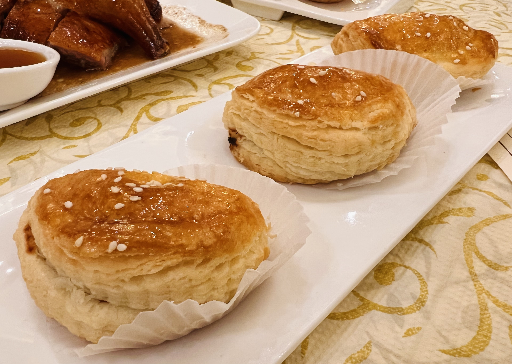
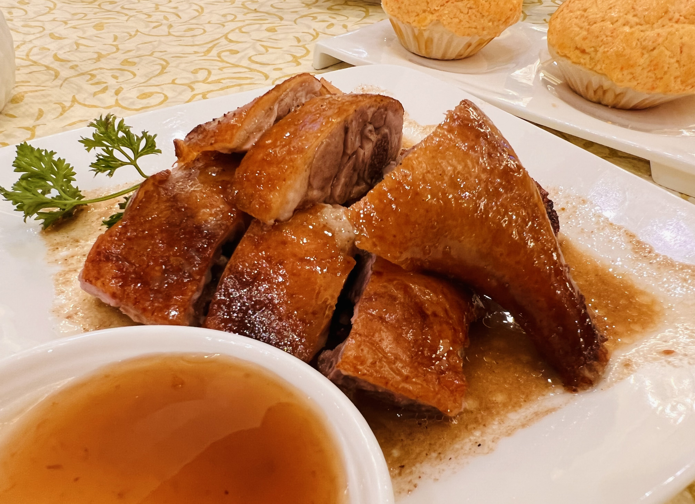
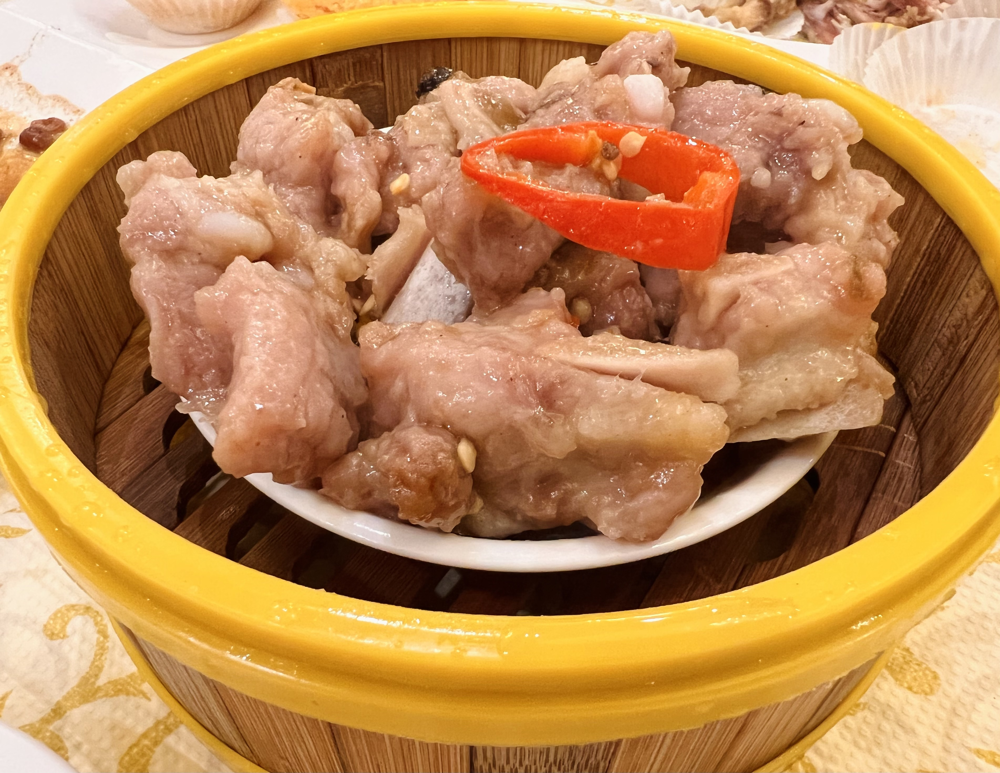
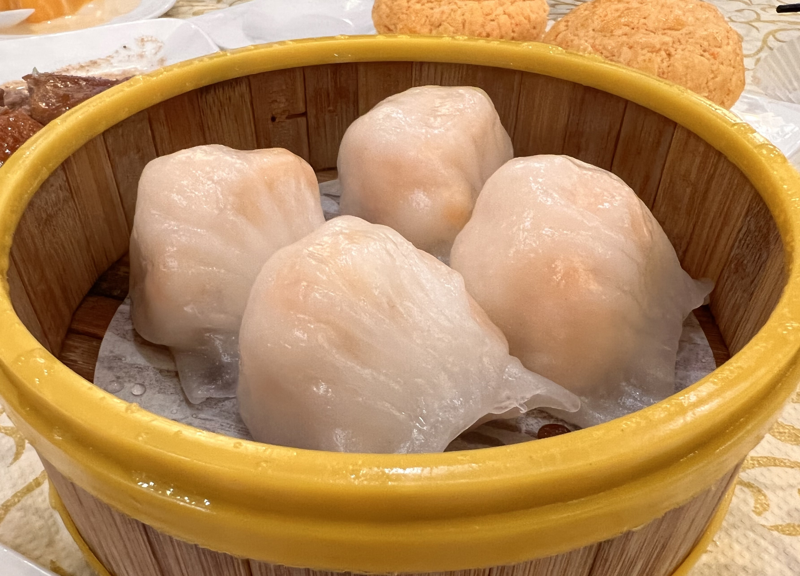
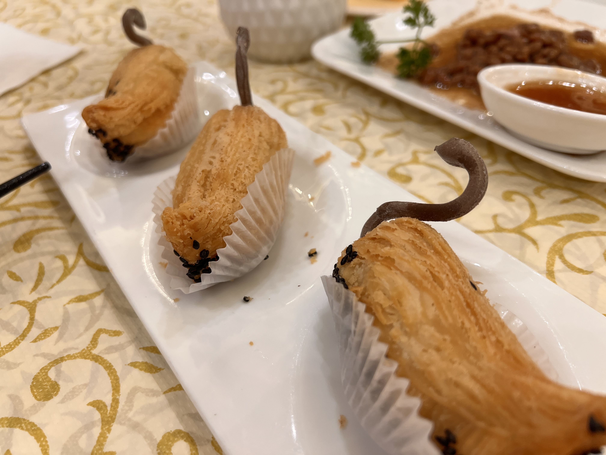
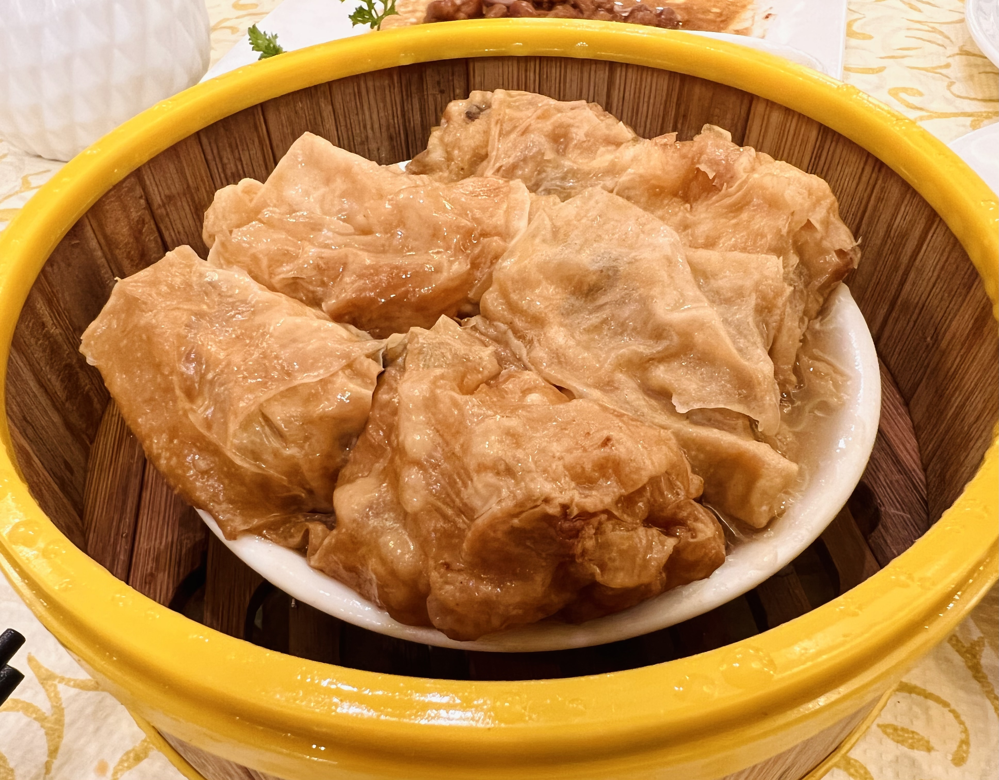

# Visit Datetime: 2022-09-24

## Explorer @kaijCH

## Overall Score 体验评分: 7/10

- 虽然并非所有茶点都值得推荐，但是酥的制作着实惊艳，可以尝试;

## Current Exploration 当前探索

### BBQ Pork Puff 叉烧酥

- 酥皮非常香，叉烧肥瘦合适，完全不吼或腻;

### House Special Hand Roasted Duck 特色明炉烧鸭

- 肥嫩适中，脆皮下的油脂偏薄口感很好，腿肉非常嫩又不失咀嚼口感

- 早茶份量较小，但是作为茶点品试滋味完全合适

### Steamed Poek Rib in Black Bean Sauce 豉汁蒸排骨

- 排骨肉意外的滑嫩，豉汁也十分上道

- 号称现斩现蒸

### Braied Chicken Feet in Abalone Sauce 鲍汁凤爪

- 熬制凤爪所带有的胶质感，鲍汁的鲜甜，给出了与寻常腐皮凤爪不同的口感和滋味，推荐尝试

### Steamed Shrimp Dumpling 笋尖蒸虾饺

- 笋的味道不是特别突出，不妨碍虾饺本身不错

### White Swan Durian Puff 白天鹅榴莲酥

- 造型比较可爱有特点，酥皮制作轻脆不腻印象深刻

- 榴莲馅不如酥皮和外形水平，总体平平

### Shredded Pork Bean Curd Skin Roll 蚝皇腐皮卷

- 热烫时的口感非常不错，腐皮卷的内容中规中矩
