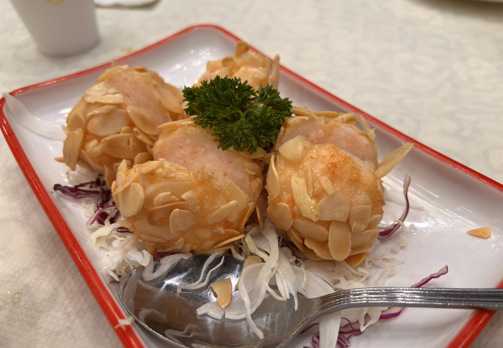
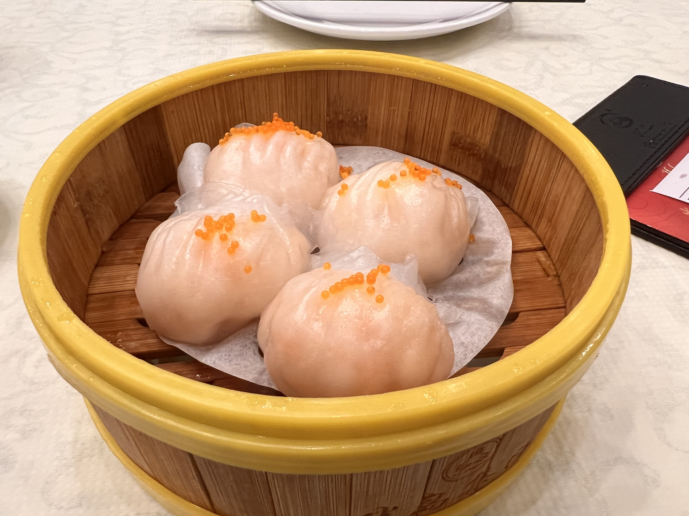

# Visit Datetime: 2022-06-24

## Explorer @kaijCH

## Overall Score 体验评分: 9/10

- 建议中午前达到前台取号，4人台排队等待时间平均20分钟

- 部分茶点相较其他早茶餐饮份量稍小

## Current Exploration 当前探索

### Pan Seared Mackerel Fish 烤青花鱼

- 鱼皮炙烤轻微焦脆，而青花鱼肉却依旧不失鲜美滋味，印象深刻

### Deep Fried Shrimp Ball with Almond Slices 杏香炸虾丸

- 虾肉饱满，与杏仁片儿混合的层次口感比较奇妙

### Shrimp Dumpling 招牌虾饺

- 饺皮薄嫩不粘连，与他处相比惊喜亦难得
