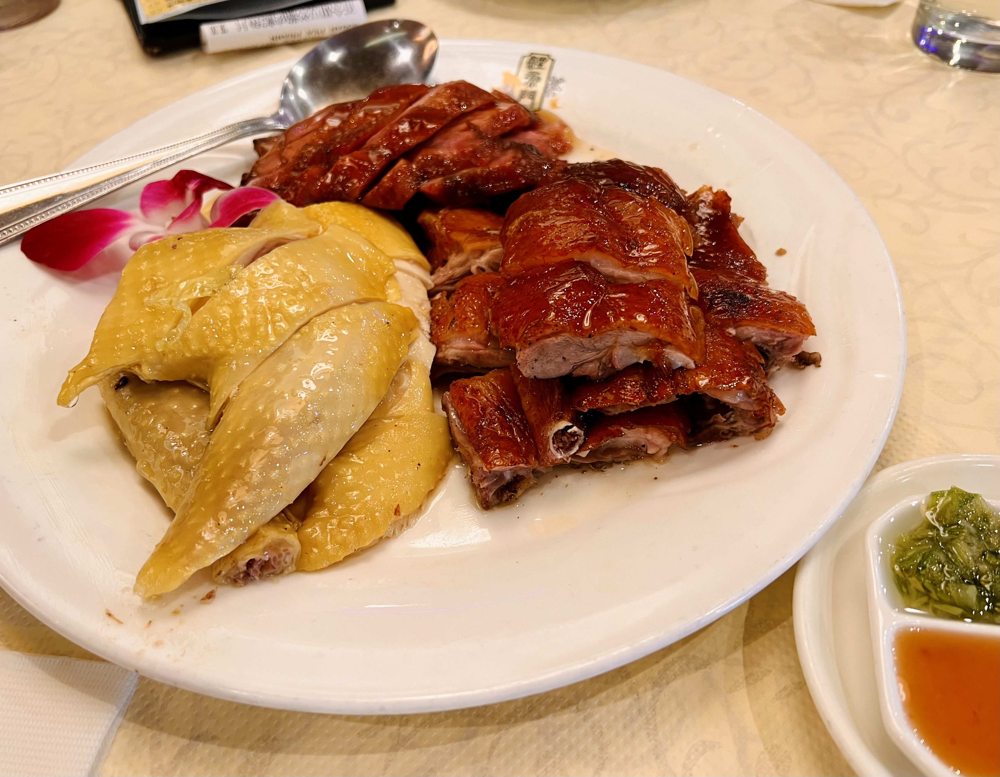
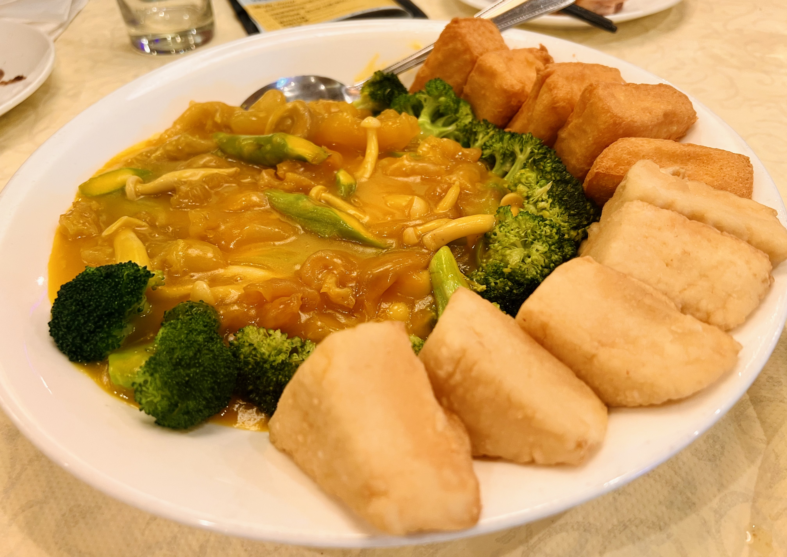
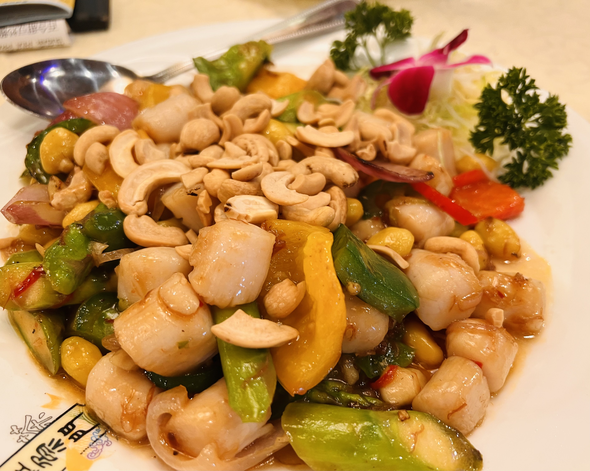

# Visit Datetime: 2022-08-20

## Explorer @kaijCH

## Overall Score 体验评分: 7/10

- 正餐时间排队和上菜时间较长可能需要有心理准备

## Current Exploration 当前探索

### Combination BBQ Platter 烧腊拼盘

- 烧鸭的皮脆肉嫩，脂层厚度适中，软骨咀嚼更是一番风味

- 白切鸡肉质滑嫩，柴肉较少，搭配姜葱蘸酱味道很好

- 叉烧刀切偏宽薄厚适中，稍有偏甜

- 中份量的装盘并不算特别特别实惠，不妨因味道推荐这道菜

### Braised House-Made Tofu with Fish Maw ⾦湯⿈炆花膠私房⾖腐

- 花胶虽然本身味道较淡，略微烫口的汤汁却能带出很好的口感和味道

- 炸豆腐很香不腻，西兰花蘸汤汁鲜香爽口

### XO Sauce Fried Scallop with Vegetables XO酱带子小炒皇

- 带子在整盘菜的量出乎意料的高，XO酱炒让黄果腰果与带子搭配在一起的口感味道恰到好处
