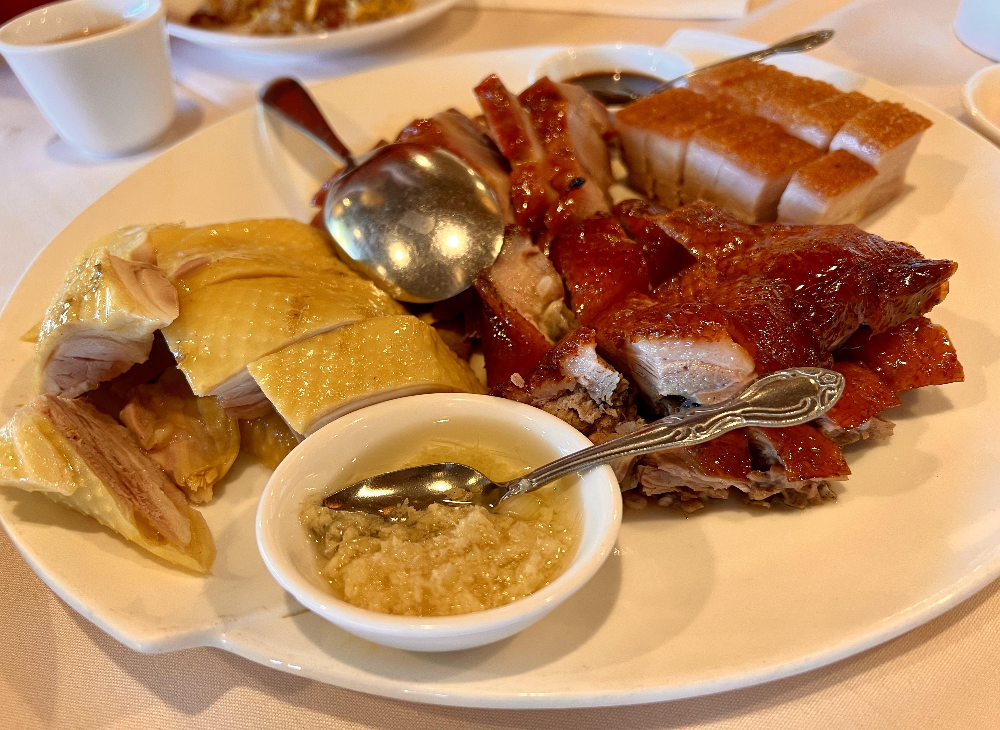
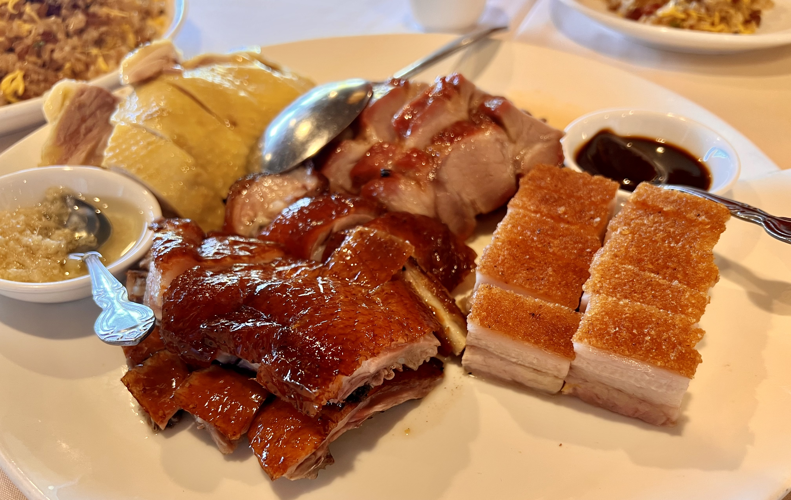
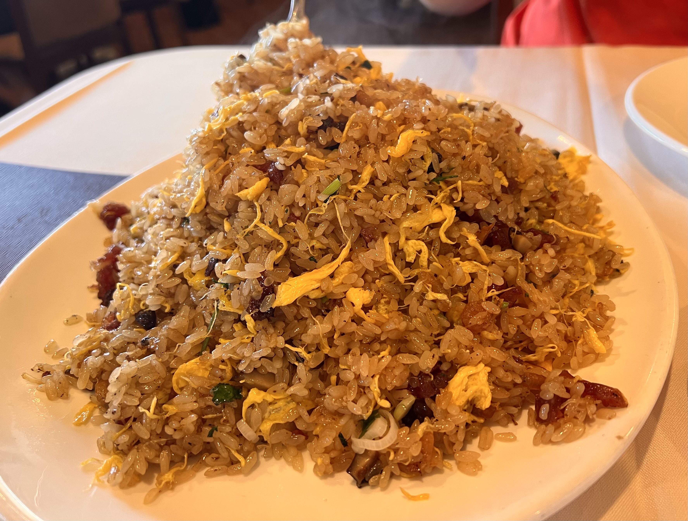
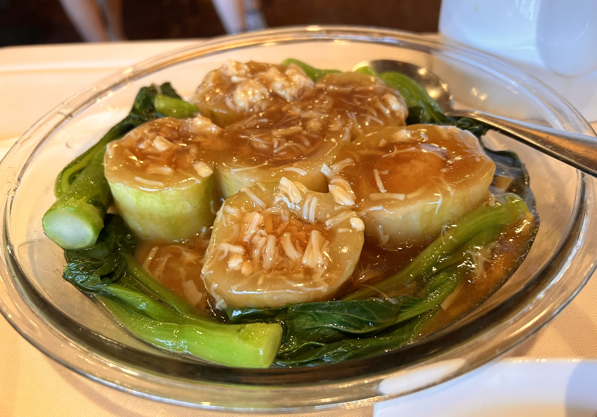

# Visit Datetime: 2022-08-07

## Explorer @kaijCH

## Overall Score 体验评分: 8/10

- 没有额外算茶位费，餐桌之间间距比正常店面宽，氛围非常放松

- 菜品主打海鲜的鲜味，并且粤式烧腊拼盘无轮肉质还是味道都很惊艳不可错过

- 用料非常"舍得"，好评

## Current Exploration 当前探索

### Combination BBQ Platter 烧腊拼盘

- 烧鸭的脂层与皮薄厚适宜，鸭肉细嫩，所附骨块大小正好，如果有耐心咀嚼软骨的话更显滋味

- 白切鸡肉质滑嫩，皮滑不肥腻，所选部位完全无柴肉，蘸配姜蓉酱味道更佳

- 脆皮烧肉实在做到肉嫩皮脆，皮质肉各层之间口感差异分明，蘸配随碟的梅子酱更是一绝，可以尝试砂糖蘸配又是另一种口味

- 叉烧肉的切法略宽，虽然甜度没有传统的高，肉质却比平常偏柴的选位讲究不少，味道稍淡但瑕不掩瑜

- 拼盘份量足而且并没有拼入边角部位，良心足称相当好评

### Stir Fried Sticky Rice with Cured Meat 腊味炒糯米饭

- 糯米炒饭中腊肉非常入味，油度适宜，整碟份量十分足

### Steam Squash Stuffed with Dried Scallop 玉环瑶柱脯

- 菜心与丝瓜都很入味，丝瓜中心的整颗瑶柱一口满足
