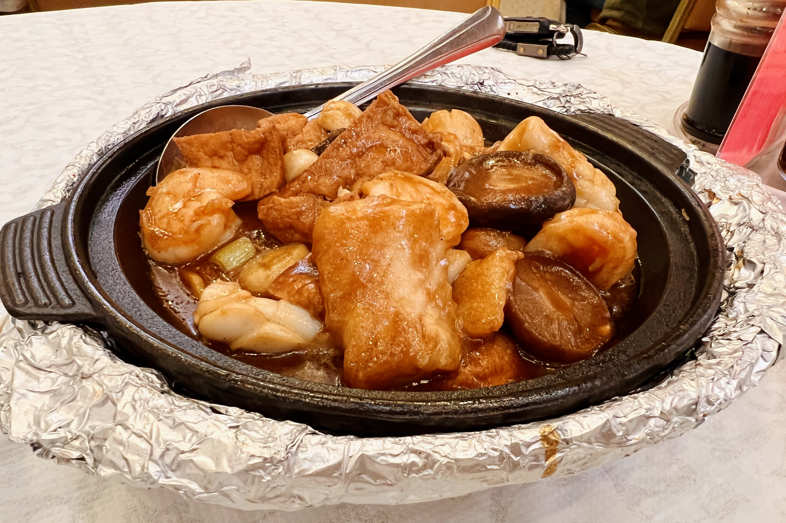

# Visit Datetime: 2022-07-23

## Explorer @kaijCH

## Overall Score 体验评分: 8/10

- 没有额外算茶位费，服务员都比较亲和

- 味道发挥中规中矩，不求哪道菜惊艳，相当对味

## Current Exploration 当前探索

### Salt & Pepper Longfin Smelt 椒盐多春鱼

- 裹粉油炸的做法与想象中略有不同，外层咸香微辣口感鲜明，又完全不夺多春鱼本身油炸的鲜香

- 多春鱼的鱼籽饱满，已经去头，夹起即可体会真正的一口满足

- 难能可贵是裹粉油炸没有额外多余的蒜味与油腻，非常推荐

### Spanished & Reserved Eggs in Broth 金银蛋上汤菠菜

- 菠菜的选料完全没有限制上汤青菜这个题材的发挥，味道咸淡适宜，不枪其他菜肴口味

- 蛋白，碎咸鸭蛋黄，碎皮蛋粒构成“金银蛋”不止增香更是添色

### Saigon Seafood Clay Pot 西贡海鲜煲

- 酱汁浓郁，海鲜肉类鲜嫩

- 如果说略有瑕疵，就是鱿鱼片入味程度还可以更好
