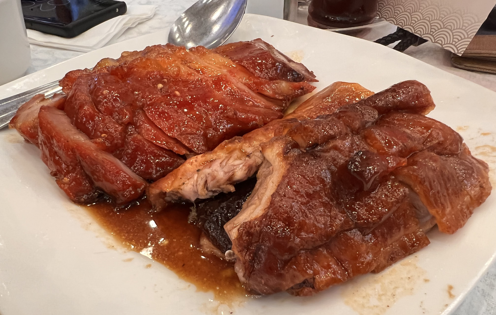
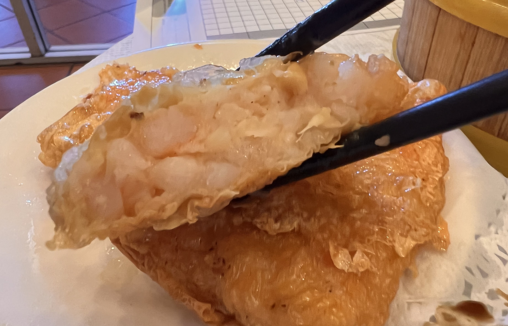
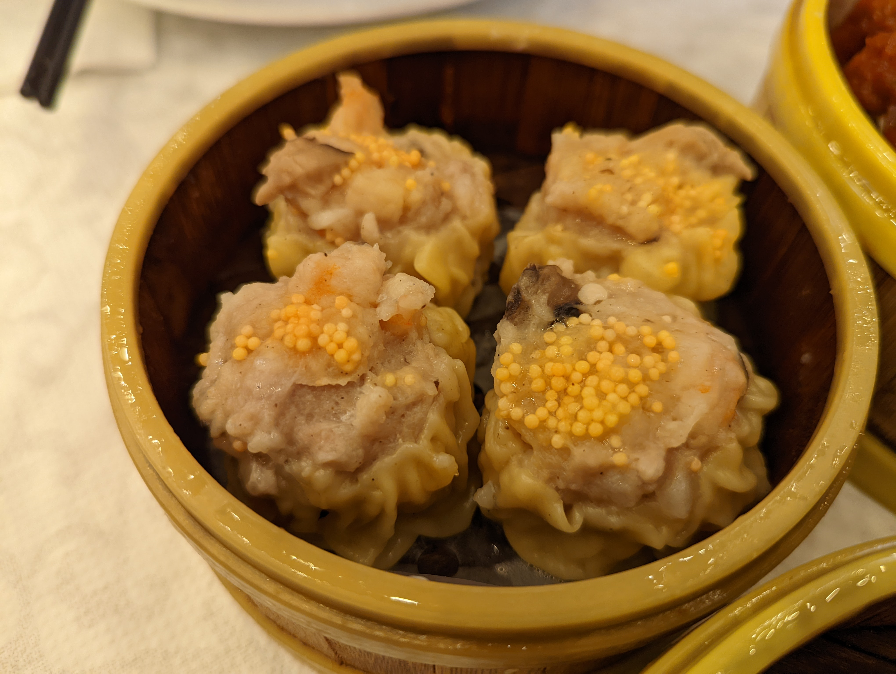
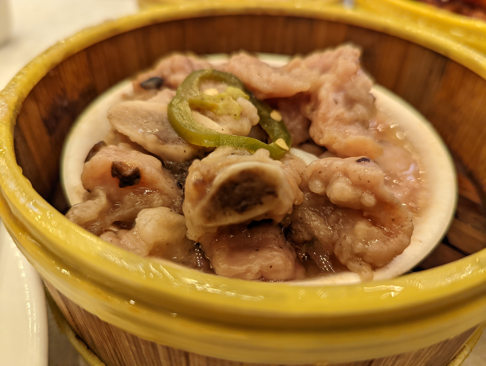
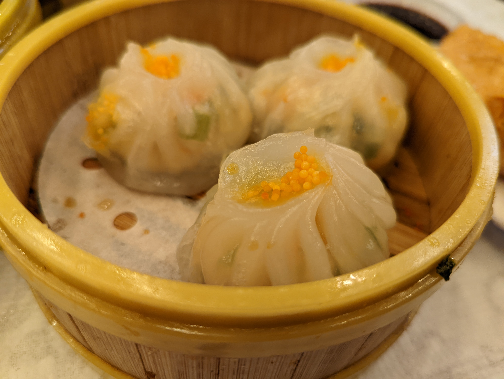

# Saigon Seafood Harbor  西贡渔港

## Location 地址

- [1135 Lawrence Expy, Sunnyvale, CA 94089](https://goo.gl/maps/qDRrEC2HfzMoP1go6)

- <https://saigonharbors.com/sunnyvale/all>

## Cuisine 菜系

- 粤式海鲜 & 早茶

## General Recommendation 推荐

### Salt & Pepper Longfin Smelt 椒盐多春鱼

- 裹粉油炸的做法与想象中略有不同，外层咸香微辣口感鲜明，又完全不夺多春鱼本身油炸的鲜香

- 多春鱼的鱼籽饱满，已经去头，夹起即可体会真正的一口满足

- 难能可贵是裹粉油炸没有额外多余的蒜味与油腻，非常推荐

### Spanished & Reserved Eggs in Broth 金银蛋上汤菠菜

- 菠菜的选料完全没有限制上汤青菜这个题材的发挥，味道咸淡适宜，不枪其他菜肴口味

- 蛋白，碎咸鸭蛋黄，碎皮蛋粒构成“金银蛋”不止增香更是添色

### BBQ Combination 烧味拼盘（叉烧与烧鹅）

- 叉烧可能沾了烧鹅的汁水，总而言之味道很怪

- 但是烧鹅的味道非常正宗，肥而不腻，尽管是冷着吃的，但是还是给予人极大的满足感

### Curd Skin Rolls 腐皮卷

- 腐皮卷非常入味

- 里面的虾很新鲜，而且很大

### Shrimp Rice Noodle Roll 鲜虾肠粉（加蛋）

- 典型的港式肠粉：皮薄富有韧性、但是又吹弹可破，入嘴如水一样沁人心田

- 由于加蛋，所以必然是现做的肠粉

- 虾非常鲜美，肉质饱满多汁

### Steamed Chicken Feet with Black Bean Sauce 虎皮豉汁凤爪

- 非常经典的粤菜虎皮凤爪，做的很好

- 豆豉很香，但是没有盖过凤爪本身带有的禽类气味和其他调味料的香味，他们之间相辅相成共同散发着诱人的香气

- 非常软烂，脱骨效果满分，没有牙齿都可以吃的凤爪

- 调味恰到好处

## Soso 一般

### Shrimp and Pork Siu Mai 虾饺

- 属于发挥中规中矩的烧麦，虾虽然很新鲜，但是调味和火候掌握没有太到位

### Steamed Pork Ribs with Plum Sauce 苏梅酱蒸排骨

- 青椒的味道实在是太冲了，并且辣度过高，吃这个本来应该是清淡菜的时候没能吃到排骨和酱的香味，反而是一股冲天的冲味。

## Shit Holes 避坑指南

### Scallop Dumpling 扇贝饺子

- 这么好吃的扇贝在香菜的味道下已经没有任何海鲜的鲜味、海味了

- 香菜的量是致死量
