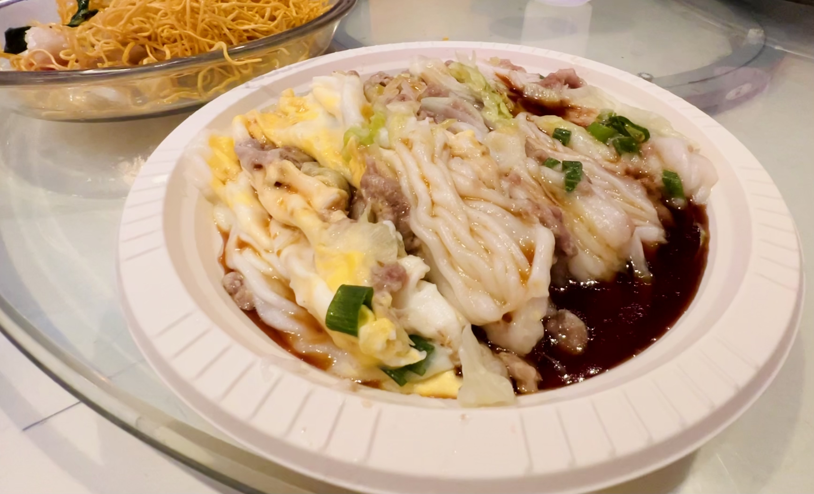

# The Spicy Shrimp  浩味园

## Location 地址

- [150 Waverly Pl, San Francisco, CA 94108](https://goo.gl/maps/bnhDF577HcGKE4g5A)

- <https://www.thespicyshrimp.com/menu.aspx>

## Cuisine 菜系

- 粤式早餐 & 街边茶餐厅

## General Recommendation 推荐

### Beef Rice Noodle Roll with Eggs 牛肉拉肠加蛋

- 拉肠与牛肉鲜嫩细腻，与甜酱油搭配正合适

### Fresh Shrimp Rice Noodle Roll with Eggs 鲜虾拉肠加蛋

- 鲜虾仁爽脆，与细腻的加蛋肠粉搭配又是另一种口感体验，非常推荐
