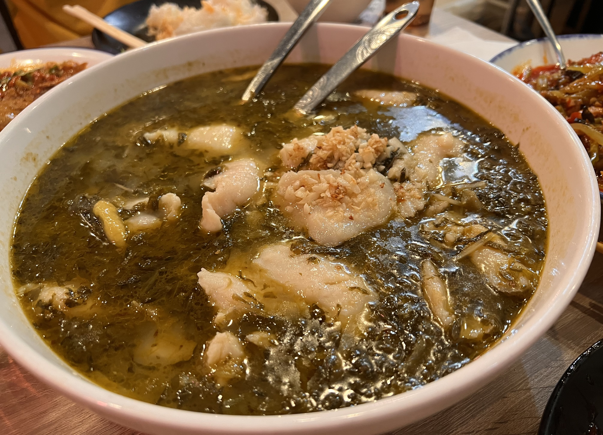
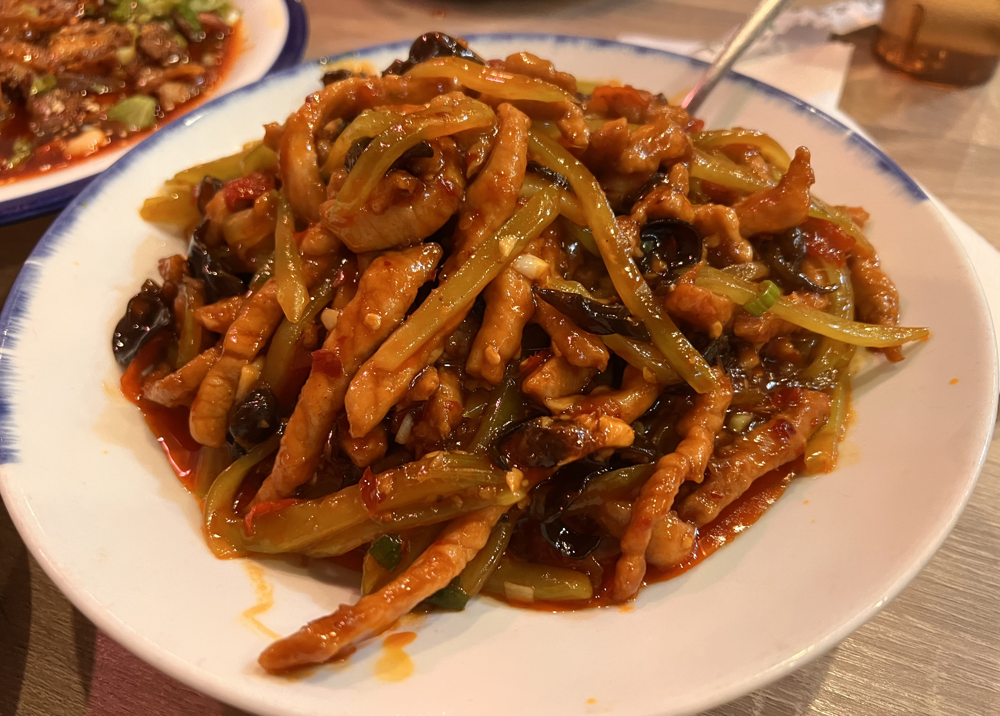

# Visit Datetime: 2022-10-09

## Explorer @kaijCH

## Overall Score 体验评分: 8/10

- Fremont店面较小，两人座的桌子并不是特别大; 味道相当不错

## Current Exploration 当前探索

### Boiled Fish Fillet with Pickled Cabbage and Green Peppers 原味老坛酸菜鱼

- 鱼肉选择巴沙口感非常非常好，默认微辣的作法让这道菜很适合成为主菜

- 默认的鱼肉份量稍少仅比两人份稍多，如果更多聚餐同行则建议多点一个青椒老坛酸菜鱼双倍过瘾

### Sliced Beef Combination in Spicy Sauce 夫妻肺片

- 香辣适宜自然，没有其他地方辣得很工业的感觉

- 刀法比较"精细"，很"耐"夹，当开胃前菜很合适

### Rose Ice Jelly with Glutinous Rice Cake 玫瑰糍粑冰粉

- 冰凉，甜度适宜，相当不错的甜品，不止解辣

### Yuxiang Shredded Pork 鱼香肉丝

- 中规中矩的菜品，下饭程度不错
