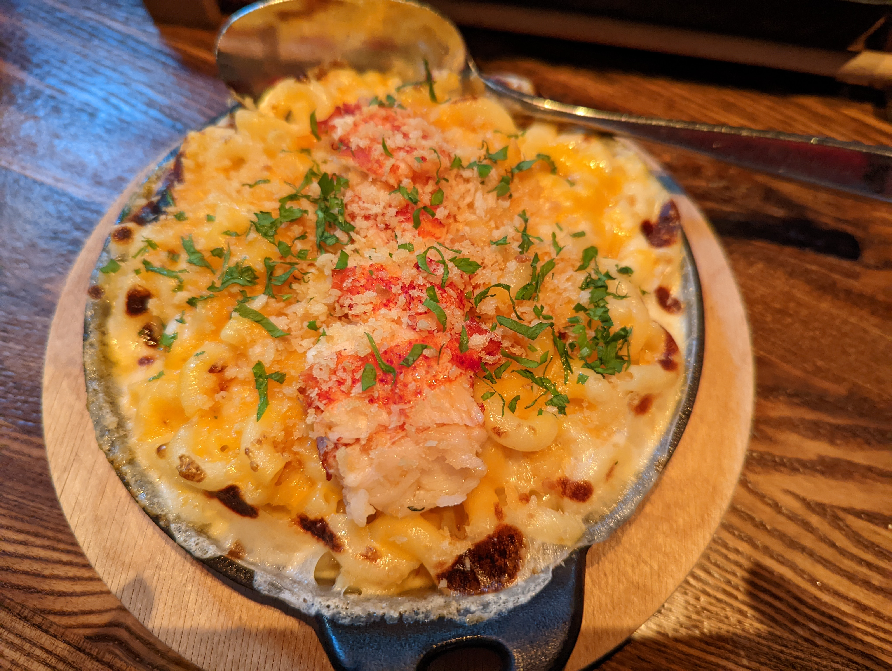

# International Smoke 国际烟熏

## Location 地址

- [301 Mission St, San Francisco, CA 94105](https://goo.gl/maps/5mZ1Jup4b6s51YFV7)

## Crusine 菜系

- Grills & Bars 烧烤和酒吧

## General Recommendation 推荐

### Corn Bread 玉米面包

- 口味方面倒不是特别好吃
- 加了龙虾酱和咖喱，使得整个面包的口味变得非常神秘，充满异域风情，这个酱可能是绝大多数人从来都没有尝试过的味道，推荐

### Korean Gochujang Style Ribs 韩式苦椒酱烤猪小排

- 非常推荐的招牌之一
- 火候恰到好处
- 脱骨效果满分
- 肉质软嫩多汁
- 肥肉不少，而更多的脂肪会带来更加丰富的口感和更加浓郁的香味

### Maine Lobster MAC 缅因龙虾通心粉&芝士

- 直接放了龙虾肉在上面，鲜味十足
- 整个菜由于放了很多很多芝士的原因，光闻着香味就让人食欲大开
- 不宜一次吃太多，否则可能会觉得腻

### Smoked Korean Bone-in Short Rib 韩式慢烤牛排骨

- 最好吃的菜！强推！必点！
- 这个牛肉虽然不是和牛，但是有和牛的口感和香味，口感来说感觉有点“松散结构”（也就是中间部分结构是中空的）的样子，而不像普通牛肉肉质可能会比较紧一点，怀疑可能是熟成的牛肉，几乎可以说的上是入口即化，并且非常多汁。总而言之口感非常独特，这也和慢烤有一定关系，火候掌握的非常精准
- 调的酱味道也恰到好处，既有自己独特的风味，也没有掩盖牛肉本身的香气
- 吃的时候香气扑鼻、口感软嫩多汁、口味恰到好处，能够赋予人极大的满足感
- 饭和泡菜真的很难吃，但是有这个牛肉谁还在意那两个呢，当个装饰品就好

### Wood-Fired Roasted Salmon 炭火烤三文鱼

- 鱼皮炙烤轻微焦脆
- 内部的鱼肉还能保持多汁的状态
- 蘑菇非常鲜，放在这道菜里更是让鱼鲜上加鲜
- 四季豆太难吃了，咬起来甚至还会发出令人讨厌的指甲划过黑板的声音，但可以不吃。可能是长得像四季豆的不知道从哪扒下来的树皮，但如果你想多来点膳食纤维，可能吃这里的四季豆是个不错的选择
