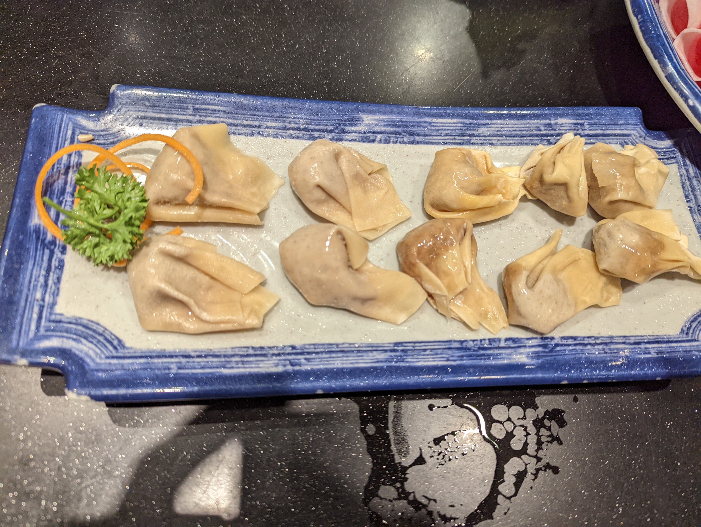
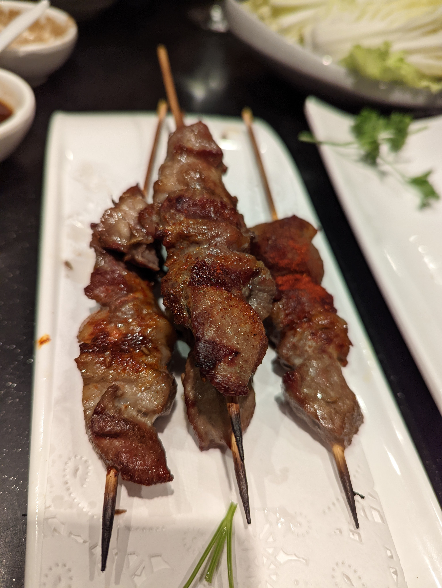
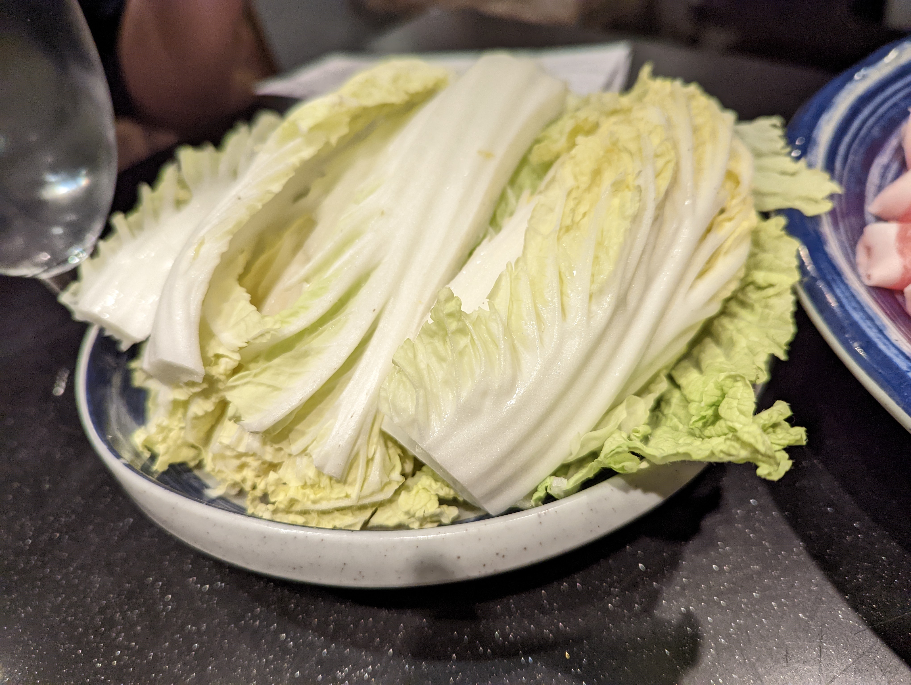
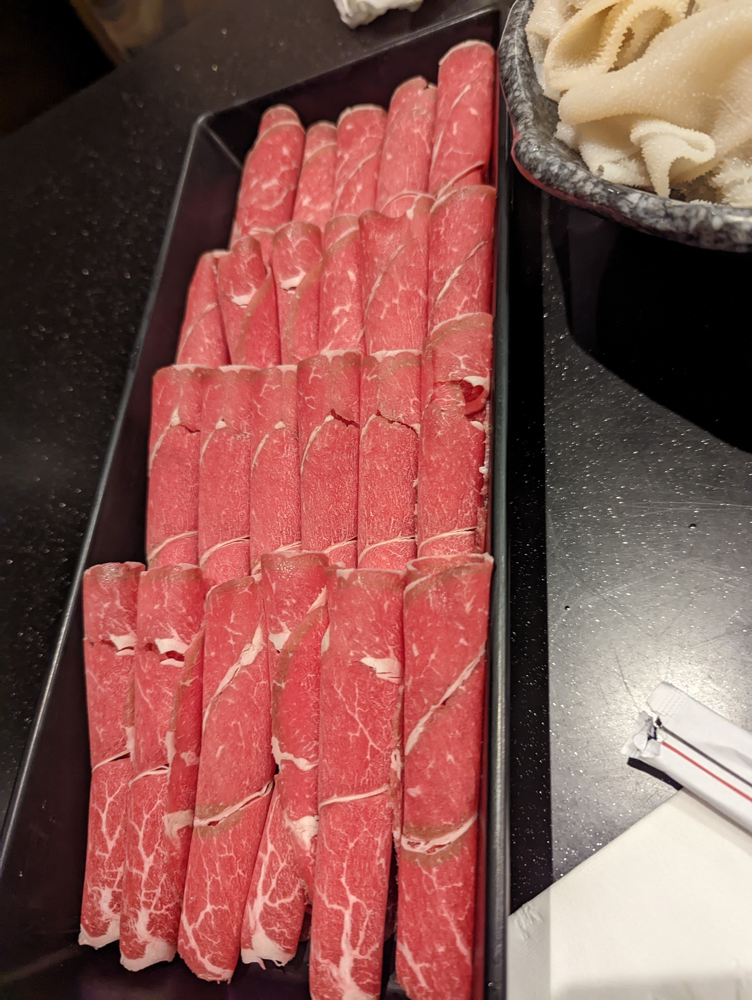

# Visit Datetime: 2022-09-11

## Explorer @tengyi

## Overall Score 体验评分: 8/10

- 不建议点除了羊肉之外的。另外人均比较贵。

## General Recommendation 推荐

### House Lamb Wontons 自制羊肉云吞

- 非常好吃，羊肉味非常浓郁，吃完后唇齿留香，强烈建议点！

### Mongolian Lamb Skewer 蒙古羊肉串

- 有点嚼劲但是不会让你嚼到咬肌酸，越嚼越香的类型。里面记得是带脆骨的。

### Napa Cabbage 大白菜

- 只要是火锅就必点的大白菜该不会有人觉得不好吃吧。它只要是个正常生长的大白菜就不可能难吃！

### Natural Prime Aged Lamb 六月羔羊

- 是不是真的六月羔羊我不知道，但是肉质确实鲜嫩肥美

## Soso 一般

### Supreme Angus Beef 高级安格斯牛肉

- 是不是真的安格斯牛肉我不知道，我觉得是假的。反正没有自己炒着好吃。