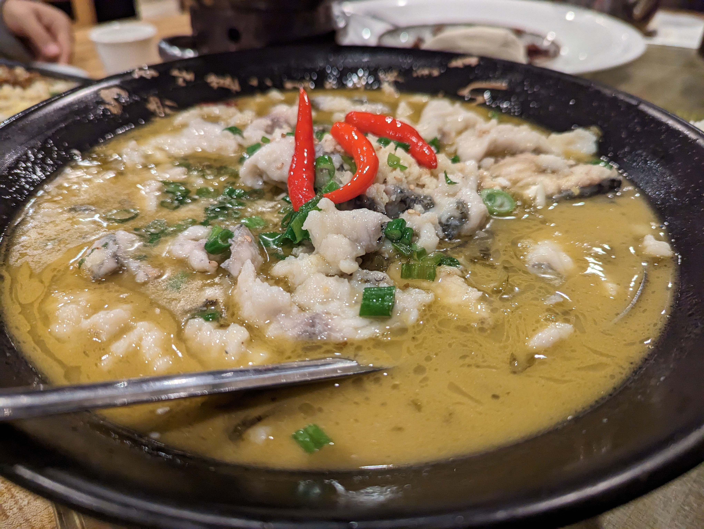
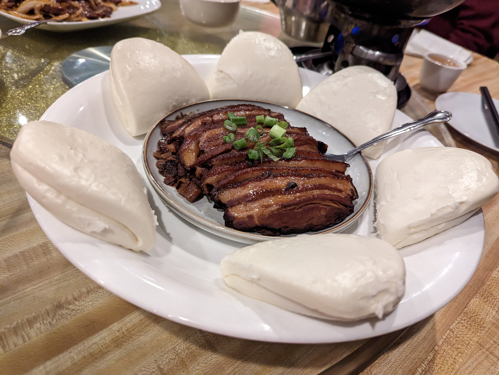
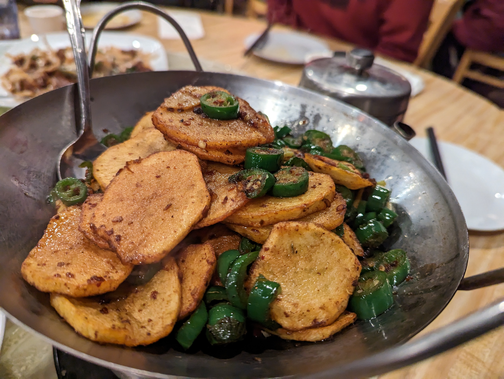
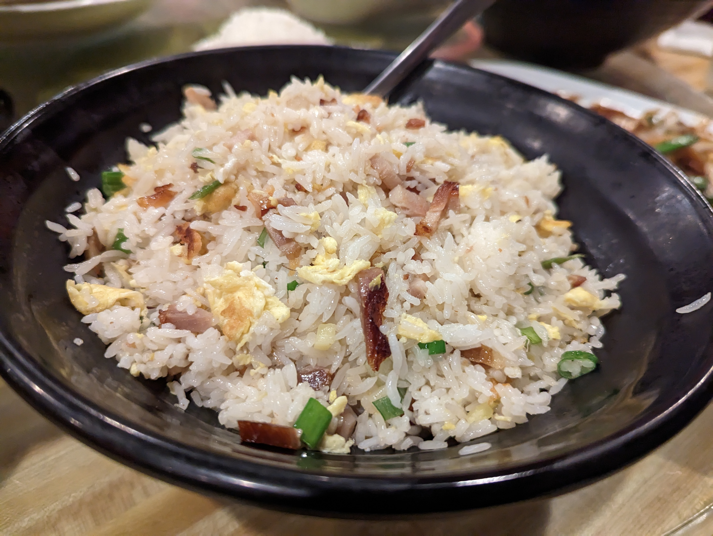
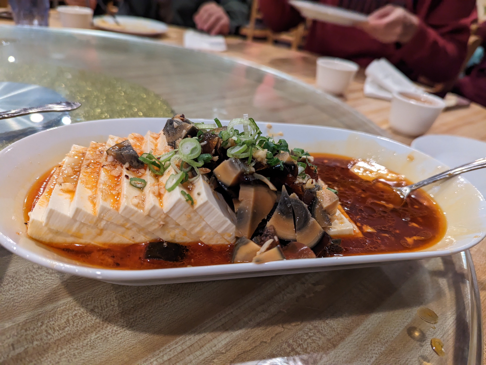
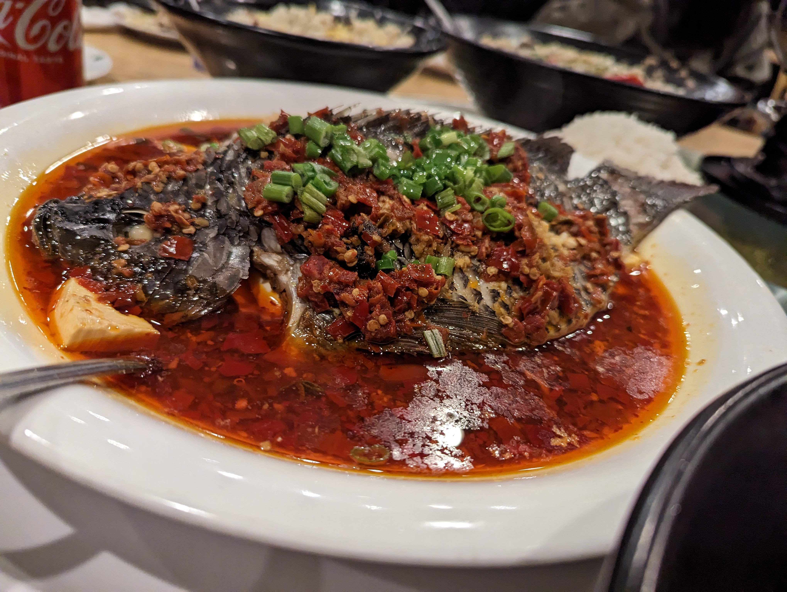
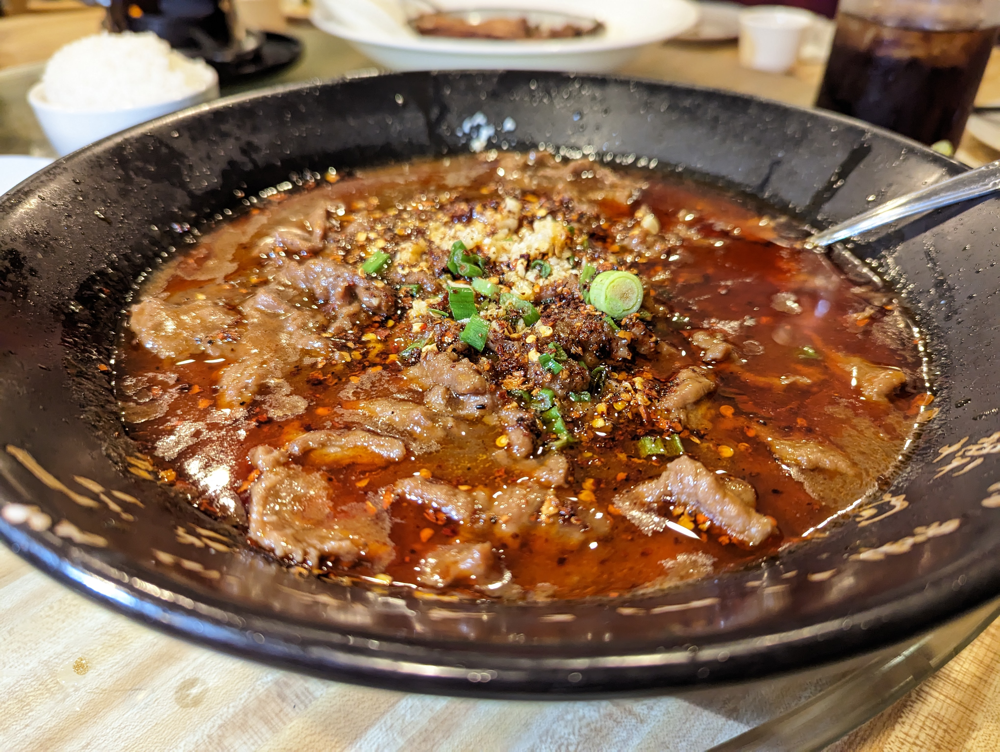

# Fan Hunan Bistro

## Location 地址

- [1616 Washington Blvd #C, Fremont, CA 94539](https://goo.gl/maps/681G8bA4mjkqSdAC9)

- <https://www.fanhunanbistro.com/order>

## Cuisine 菜系

- Hunan Cuisine 湖南菜

## General Recommendation 推荐

### Beef & Green Onion Stir Fry 葱爆牛肉

- 非常好吃的葱爆牛肉，葱的香味恰到好处，不会掩盖牛肉的香味。
- 牛肉炒的熟度非常均匀，火候很到位。

### Boiled Fish with Sichuan Pickles 巴蜀酸菜鱼

- 虽然是个湘菜馆但是做四川的酸菜鱼却一点不差
- 酸菜不会太酸，恰到好处非常开胃

### Braised Pork with Preserved Vegetables 梅菜扣肉

- 目前应该是吃过的在湾区最好吃的梅菜扣肉（至少2022-12-18之前）
- 扣肉肥而不腻。

### Fried Potato Slices with Diced Chilies 干锅土豆片

- 干香干香，非常好吃。

### Smoked Ham Fried Rice 湖南腊味炒饭

- 湖南的腊味向来是非常有名的，这道腊味炒饭的腊味也是非常正宗的湖南腊味

### Thousand Year Old Egg with Cold Soft Tofu 湘西皮蛋捣豆腐

- 想想就流口水的皮蛋捣豆腐。
- 辣味不重，根本没有盖过豆腐的清香。

## Soso 一般般

### Fan Bistro Steamed Fish with Chipped Peppers 湘味剁椒鱼头

- 感觉有点楞辣而香味不够。没有发挥出湘菜香辣的特点。

### Old Chongqing Fatty Beef Slice with Soft Tofu 老成都豆花肥牛

- 太油了。
- 太辣了。
- 我不知道这到底是成都菜还是重庆菜，但是英文和中文的差别可能会让两个城市的人打起来。
- 建议下次可以直接呈上来一道菜叫油泼辣子。