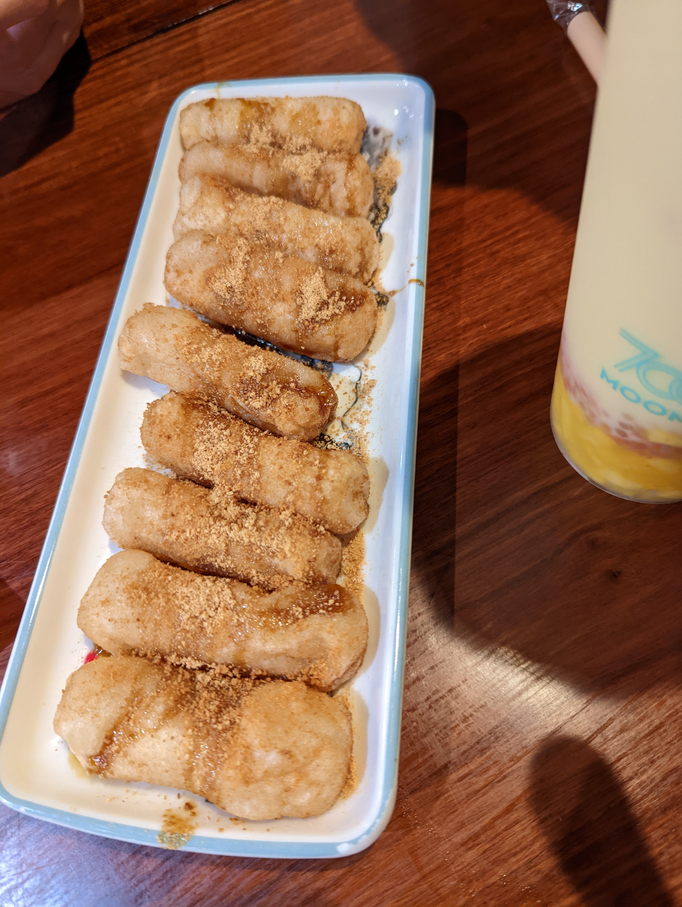
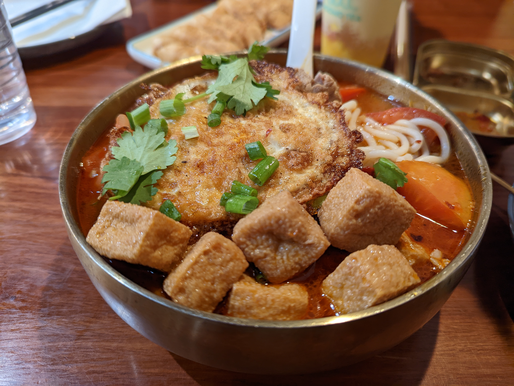
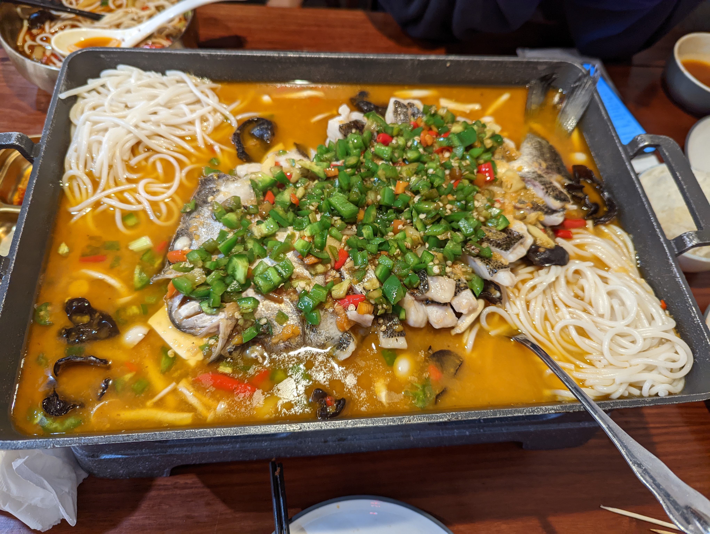

# Fu Niu Tang Noodle Talk 福牛堂

## Location 地址

- [711 Sunnyvale Saratoga Rd, Sunnyvale, CA 94087](https://goo.gl/maps/Tkfr8DmVE5iHcG1s8)

- <https://www.noodletalkus.com/>

## 注意事项

- 福牛堂最近传言收15%的食品税，并且可能收税后消费，注意仔细查看账单
- 味道其实一般般，但是在价格的衬托下还算可以。

## Cuisine 菜系

- Hunan Cuisine 湖南菜

## General Recommendation 推荐

### Handmade Sticky Rice Cake With Honey 手工蜂蜜糍粑

- 调味正好：不太甜，但是能够成功地引起你味蕾的注意
- 糍粑选用的糯米应该是非常不错的糯米，味道很软糯，并且有比较明显的糯米香味。

## Soso 一般般

### Marbled Beef With Tomato Noodle Soup 番茄肥牛米粉

- 味道正常的一碗米粉。
- 米粉还是有他自己的清香的
- 肥牛可能品质稍微欠佳，考虑到价格，还算是正常

### Rattan Pepper And Fish Fillet 藤椒酸菜黑鱼

- 味道还是非常正宗的一个藤椒酸菜黑鱼
- 藤椒的香味和其他辣椒和青椒相得益彰，把整道菜的香味都释放出来。
- 酸菜的味道也正恰到好处，既不会抢了鱼的味道太酸，也不会显得没什么味道
- 问题是辣味有点过重，导致鱼味有点被盖住了。
- 面条太多了。
- 这个辣椒比较呛，再加上有鱼汤，吃的时候要小心。