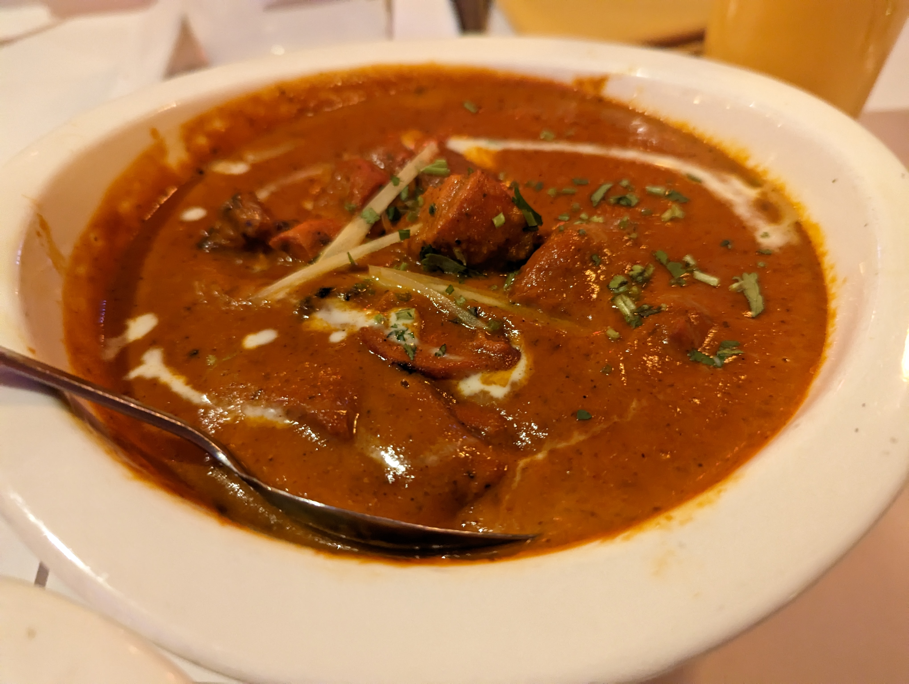
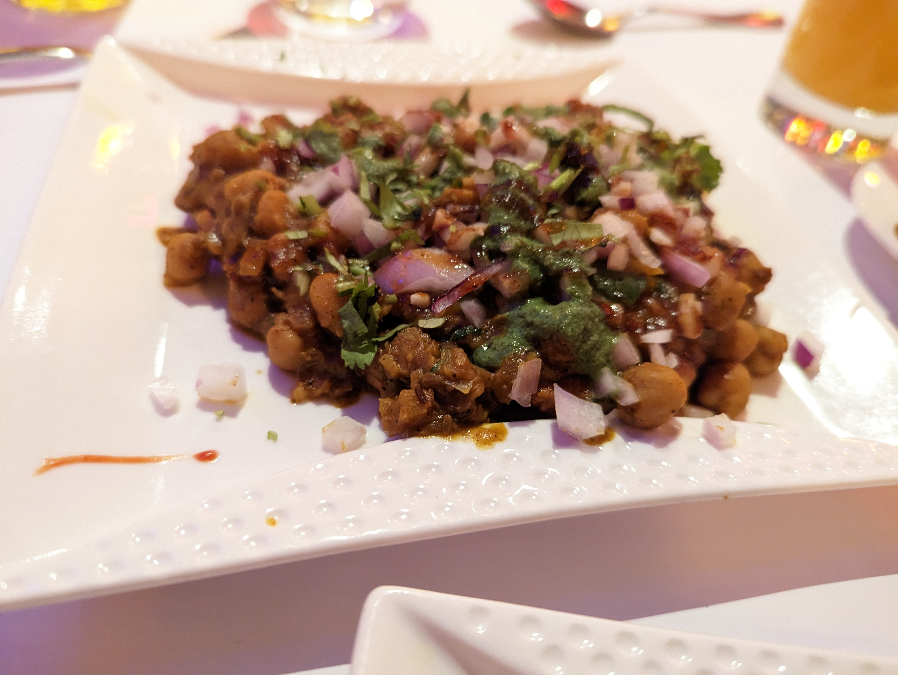
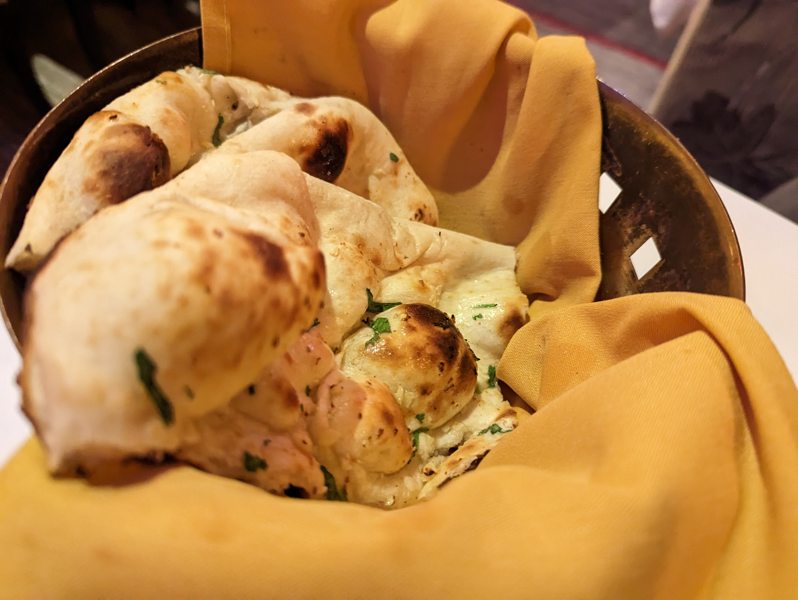
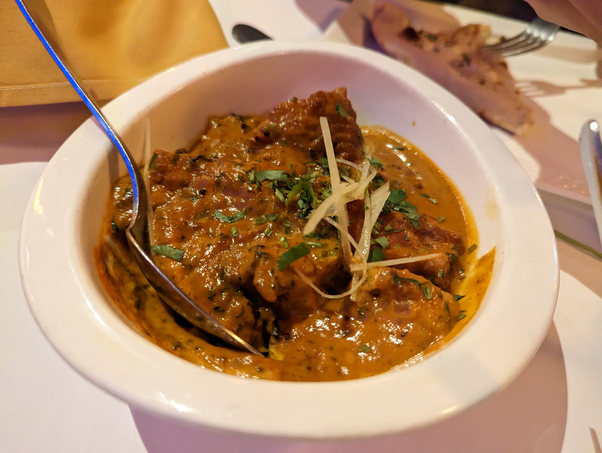
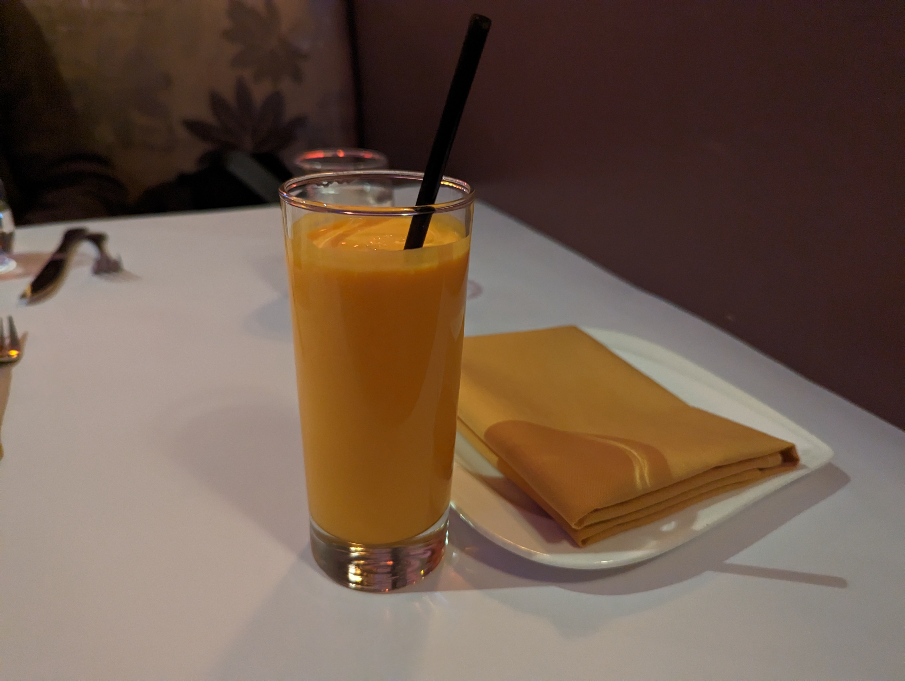
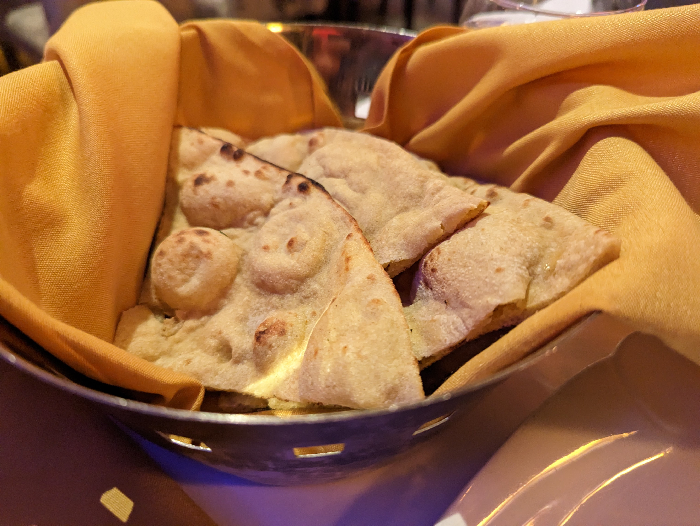
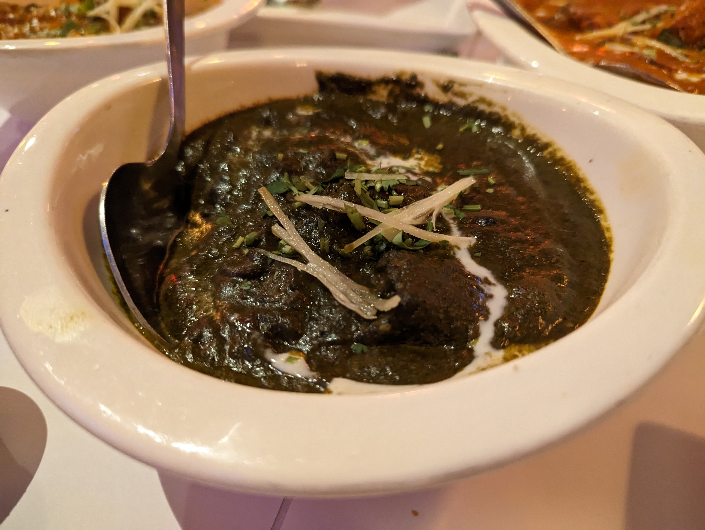
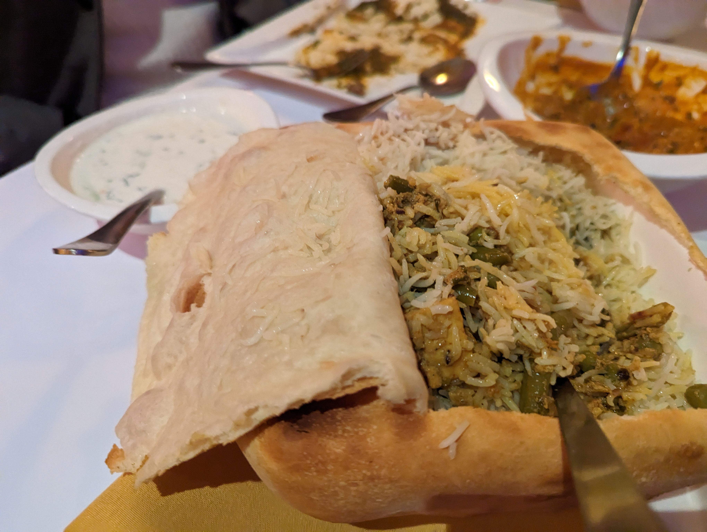
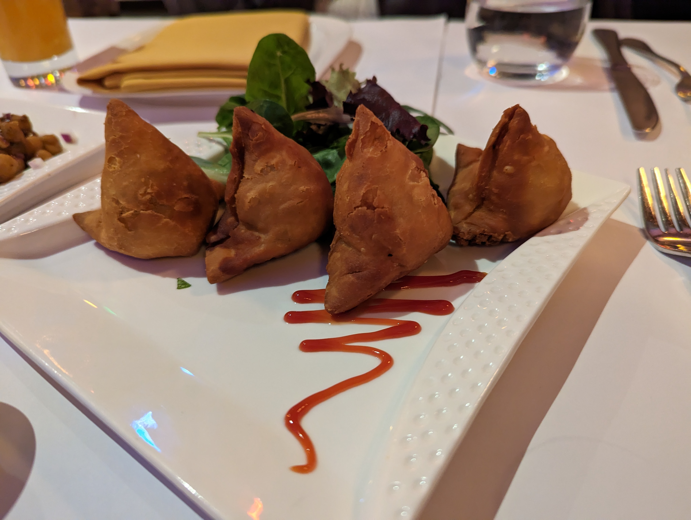

# Visit Datetime: 2023-01-16

## Explorer @tengyi

## Overall Score 体验评分: 8.2/10

- 有一些菜的味道还是感觉怪怪的（尤其是一些作为蘸料的酸奶），不过他们的主菜还是很不错。

## General Recommendation 推荐

### Butter Chicken 咖喱黄油鸡

- 用黄油浸泡的番茄酱鸡肉，最后加入葫芦巴奶油
- 这算是印度一道比较出名的菜了，有很丰富的香料和番茄香气和奶油口感。

### Chef's Special Channa Pindi 厨师特色炒鹰嘴豆

- Rawalpindi风格炒的香料鹰嘴豆，整体风味比较浓郁。

### Garlic Naan 大蒜印度烤饼

- 印度的Naan向来是非常好吃的。到目前为止吃过的印度餐厅应该没有一个是不好吃的，虽然烤饼的制作工艺也不是那么难就是了。。。

### Konkani Fish Curry 孔卡妮鱼肉咖喱

- 孔卡妮风格的鱼肉咖喱，使用香草、香料和椰奶进行烹饪。
- 虽然香料的味道很重，但是还是没有盖过鱼肉本身的味道，仍然能够吃到鱼的香嫩的口味，而且在香料的作用下鱼肉的腥味几乎一点都没有。这对于一个喜欢吃本味的人来说还不错。

### Mango Lassi 芒果拉西

- 太TM好喝了，建议必点。
- 一半的做法是新鲜芒果、酸奶、牛奶和一些调味品混合一起制作而成。可能还有一些橙花水或者玫瑰花水，整个饮料的口感绵密，香味神秘而且诱人。

### Plain Naan 印度烤饼

- 同上，这个没什么好说的，烤的确实不错。

### Saag Gosht 菠菜羊肉

- 因为把香草、菠菜、和其他香料和羊肉一起烹制，所以酱汁显现的颜色显得非常诡异。
- 虽然如此，但是羊肉咖喱向来是我的菜，味道非常不错。

## Soso 一般般

### Coconut Rice Biryani 椰子米饭Biryani

- 时间有点久远，没什么印象，那就是一般般。
- 记得比较辣，但是不是香辣，楞辣。

### Sakoon Special Samosa Sakoon特制咖喱角

- 记得比较辣，除此之外没什么特别的。
- 楞辣。