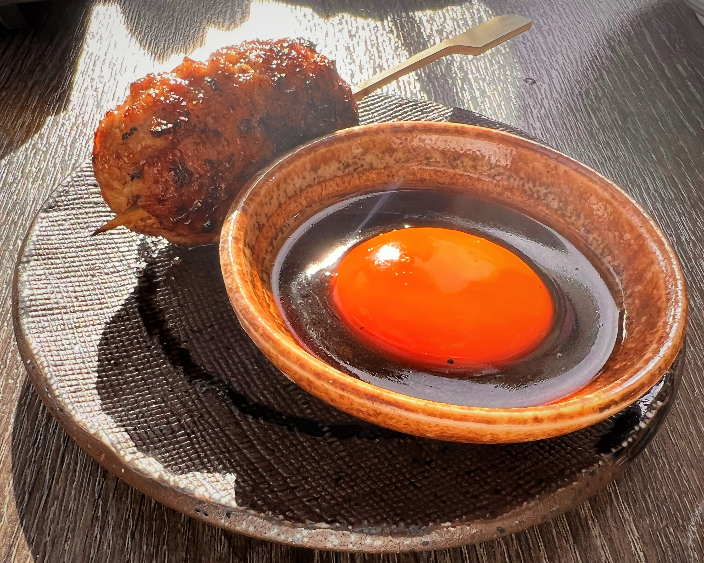
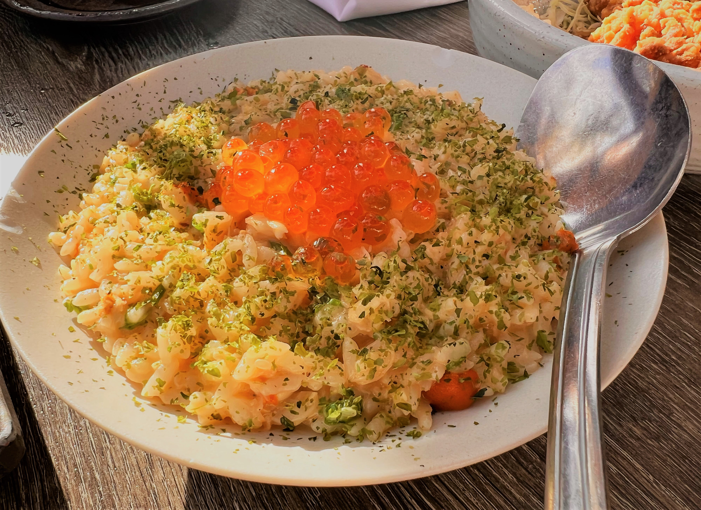
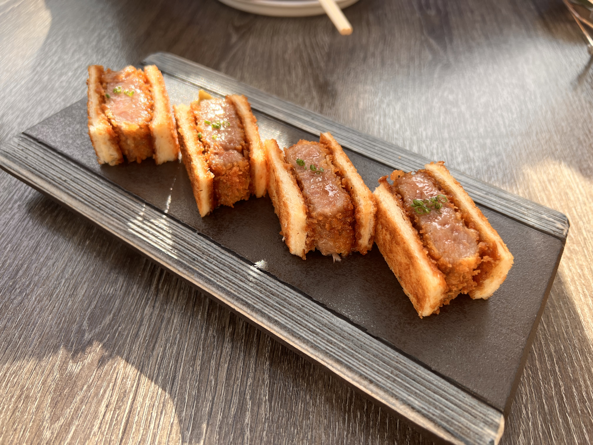

# Bushido Izakaya  武士道居酒屋

## Location 地址

- [156 Castro St, Mountain View, CA 94041](https://goo.gl/maps/o38UCN9J92d7ppyy5)

- <https://bushidorestaurant.square.site/>

## Cuisine 菜系

- 主创新的居酒屋日餐，适合少于4人尝试新菜式

## General Recommendation 推荐

### Tsukune 鸡腿烧丸与生蛋黄蘸酱

- 鸡腿肉质鲜嫩不失弹劲口感，烧汁咸度适宜

- 蘸酱的生鲜蛋黄让鸡腿肉口感更鲜，也让吃的过程很有意思

### Uni Kani Risotto 蟹肉海胆烩饭

- 蟹肉丝料足味鲜，与米粒和烩酱结合口感非常好评

- 海胆和鱼籽给烩饭增加了不一样的鲜味，拌着吃单独吃味道都不错，粉量不少

- 烩饭量不大不会对其他菜品的尝试构成压力

### Wagyu Katsu Sando 和牛三明治

- 尝鲜菜式，偏脆的烤吐司片与较嫩和牛结合的口感和观感都有意思
