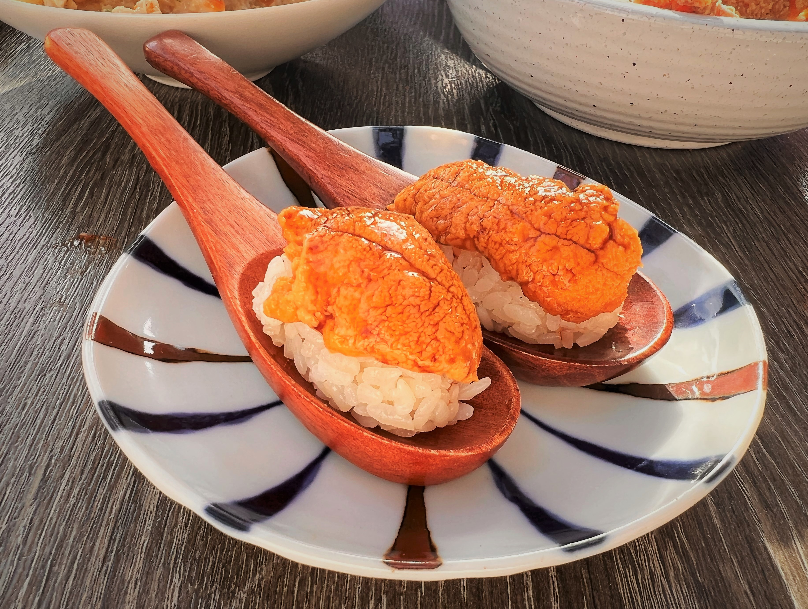
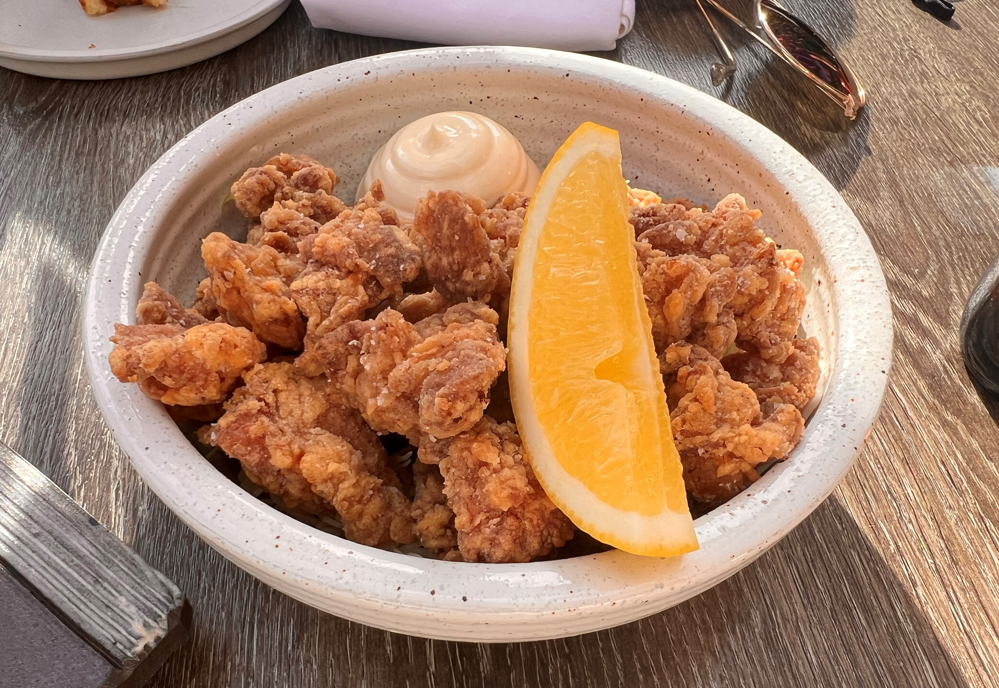
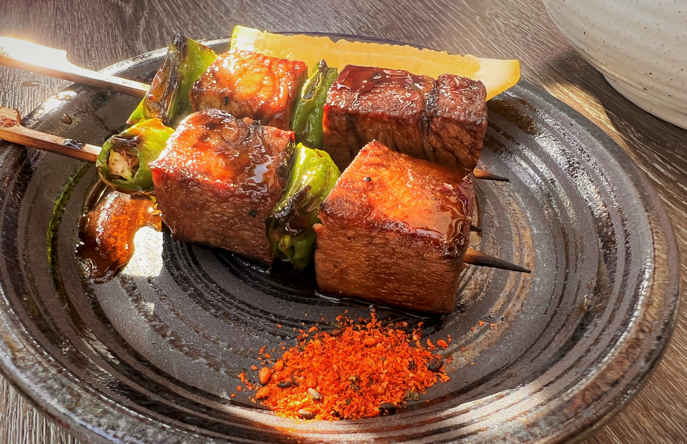
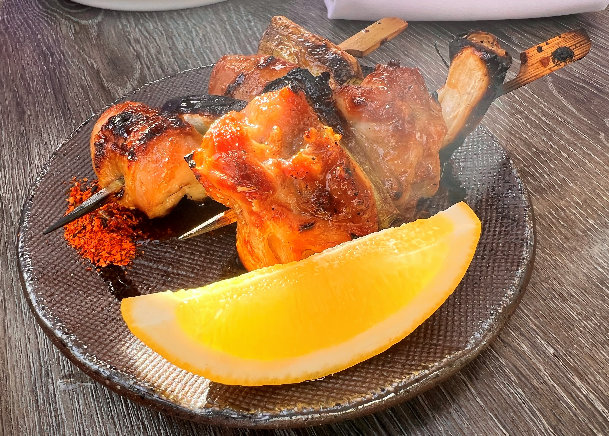

# Visit Datetime: 2023-01-14

## Explorer @kaijCH

## Overall Score 体验评分: 7/10

- 晌午的户外座位也不错，排队等位可以接受不会太久

## Current Exploration 当前探索

### Tsukune 鸡腿烧丸与生蛋黄蘸酱

- 鸡腿肉质鲜嫩不失弹劲口感，烧汁咸度适宜

- 蘸酱的生鲜蛋黄让鸡腿肉口感更鲜，也让吃的过程很有意思

### Uni Kani Risotto 蟹肉海胆烩饭

- 蟹肉丝料足味鲜，与米粒和烩酱结合口感非常好评

- 海胆和鱼籽给烩饭增加了不一样的鲜味，拌着吃单独吃味道都不错，粉量不少

- 烩饭量不大不会对其他菜品的尝试构成压力

### Uni Feast 海胆拼盘饭团

- 每份可选两种海胆，吃个鲜味，跟饭团一起过瘾

### Wagyu Katsu Sando 和牛三明治

- 尝鲜菜式，偏脆的烤吐司片与较嫩和牛结合的口感和观感都有意思

### Nankotsu Karaage 炸鸡脆骨

- 比较常规的居酒屋小菜，裹面相对合适不会太厚

### Beef Tongue Skewer 烤牛舌串

- 整体味道不错，但是口感比较软没有常规的弹劲，与预期的感觉不太一样

### negima Skewer 烧鸡腿肉串

- 鸡肉串的肉质口感相比鸡腿肉烧丸更弹，葱段经过烧制不会过于抢味可以一试
