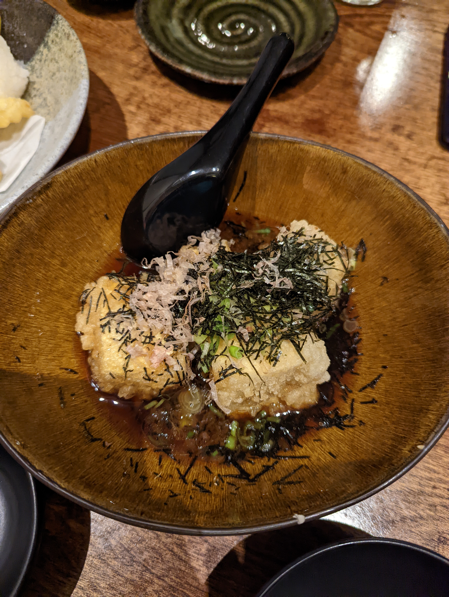
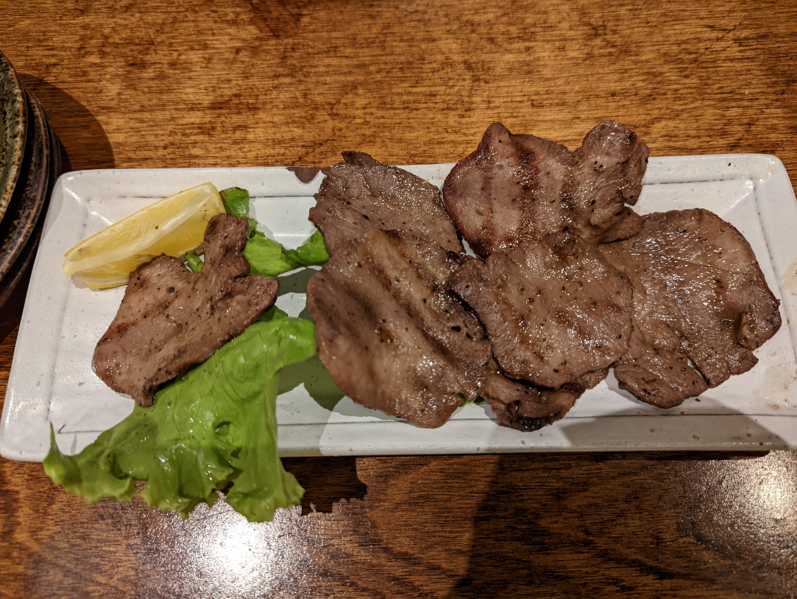
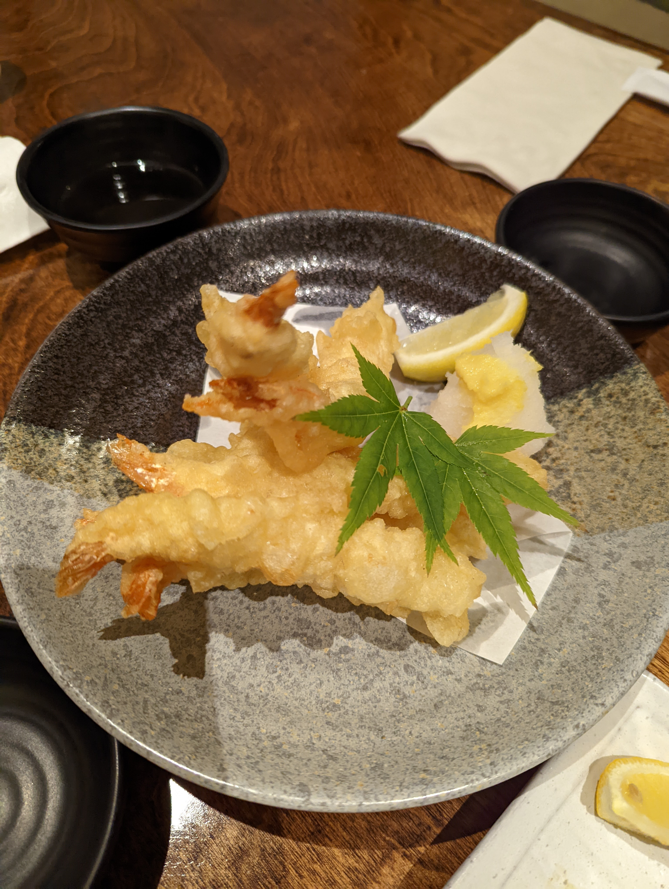
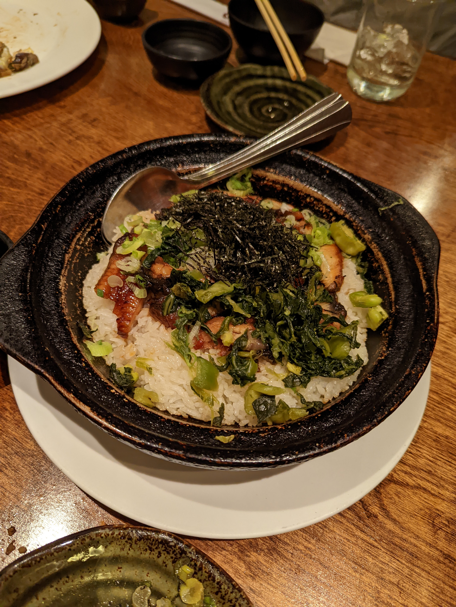
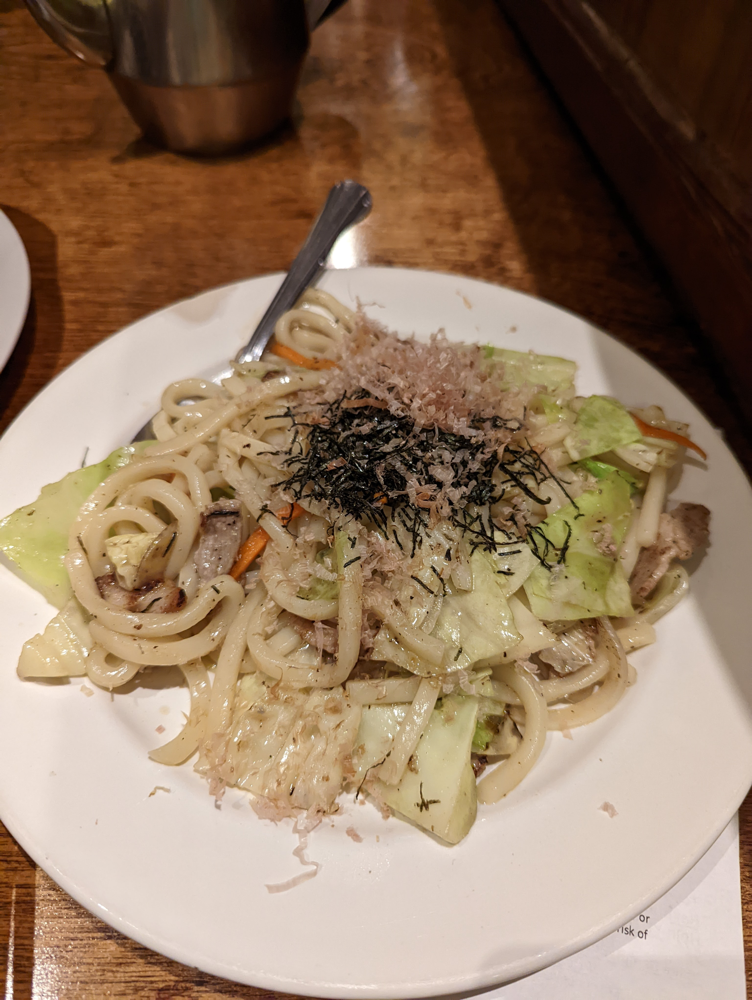
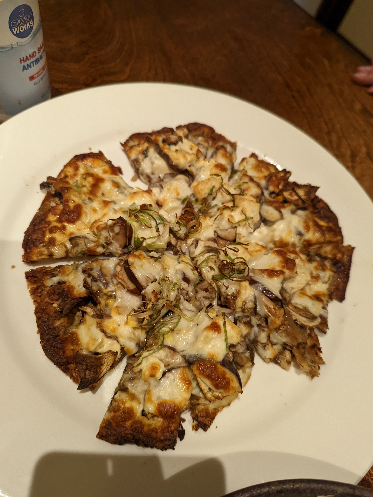
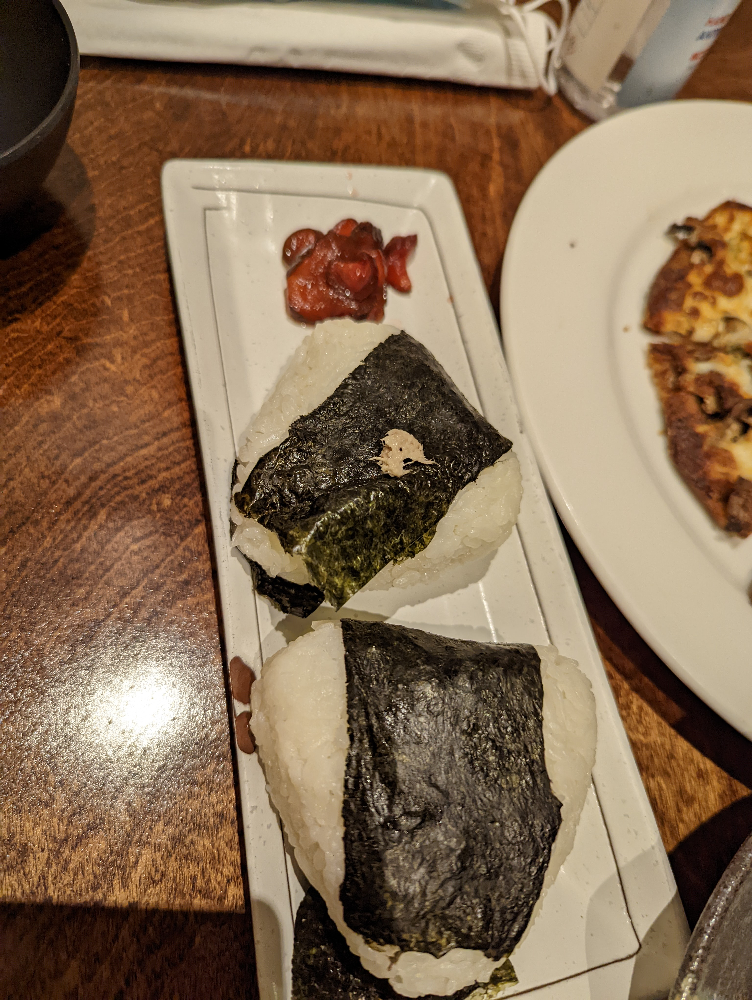

# Visit Datetime: 2022-06-11

## Explorer @tengyi

## Overall Score 体验评分: 9/10

## Current Exploration 当前探索

### Agedashi Tofu 炸豆腐

- 外脆里嫩，但是还算是老豆腐的范畴，豆香味非常浓郁
- 酱略微有点咸，不太吃盐的注意一下

### Gyutan Shioyaki 烤牛舌

- 牛舌香味非常浓郁
- 有点嚼头，但是不老

### Shrimp Tenpura 天妇罗虾

- 蘸酱吃非常好吃，虾很新鲜，肉很鲜嫩，而且是虾肉真的大，非常满足

### Unagi Meshi 鳗鱼饭（必点）

- 强推！
- 他们家的招牌！
- 鳗鱼无骨无刺，软嫩鲜香，吃起来有种糯糯的口感
- 调味比很多鳗鱼饭没那么咸，更好下口
- 酒味清香，不像很多鳗鱼饭酒味过重或者过少导致没有助长足够的香气

### Yaki Udon 烧乌冬

- 乌冬面这种粗面条向来是我的最爱

## Soso 一般般

### Natsu Tofu Pizza 夏日豆腐比萨

- 不能说不好吃，但是就是味道有点怪（有茄子、豆腐等对于比萨来说显得有点奇怪的食材）

### Onigiri 饭团

- 可以自己选裹什么吃，比如三文鱼、金枪鱼之类（这次吃的是金枪鱼）
- 但是确实味道一般

### Shanghai Style Pot Stickers 上海生煎包

- 汤还是可以的

- 底太硬了，有点划喉咙

## Shit Holes 避坑指南

暂未发现
