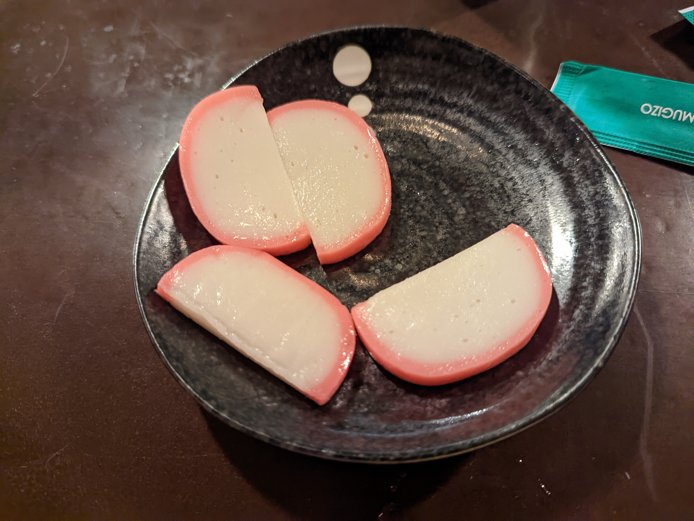
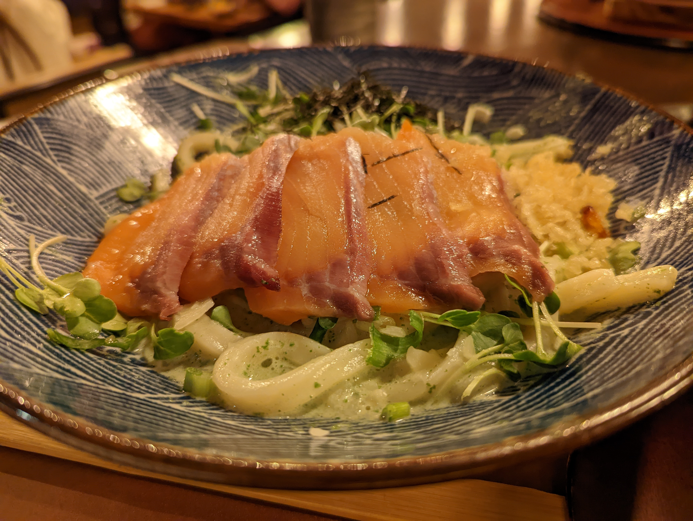
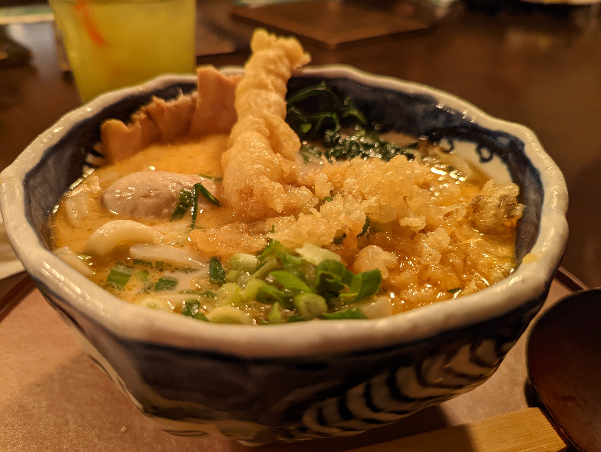

# Visit Datetime: 2022-10-02

## Explorer @tengyi

## Overall Score 体验评分: 8.5/10

总体来说没有什么短板的一次体验，但是也没有特别特别惊艳的地方。

## Cuisine 菜系

- Japanese 日本菜

## General Recommendation 推荐

### Agedashi Tofu 炸豆腐

- 外皮焦脆，而内里却仿佛根本没有炸过的豆腐脑一样，顺溜地就滑进了你的心里。
- 豆腐本身味道很淡，但总体而言像清泉一样流入你的心中。觉得淡了可以多浇汁。

### Fish Cake 鱼饼

- 冷的，但是没什么腥味，非常Q弹，有嚼劲，但是和硬没什么关系。口感绝佳
- 看上去很像萝卜

### Salmon Spinach Cream Sauce Udon 三文鱼菠菜奶油乌冬面

- 三文鱼有轻微烟熏的味道，很香，不错，并且鱼肉软嫩香甜，明显感觉出来是新鲜鱼肉。问题在于表皮上抹盐太多，而这又不属于汤面，于是导致三文鱼太咸
- 乌冬面的口感比较浓稠，菠菜奶油除了菠菜和奶油之外还加了芝士，让整个菜的香味更加浓郁。尽管加了奶油和芝士，却并不会觉得腻，说明糖和脂肪的比例还是比较规矩。
- 虽然看上去是个黑暗料理，但是实际上却非常好吃。

### Tonkotsu Udon 猪骨乌冬面

- 有三个辣味选项：no spicy, medium spicy, spicy。点的是medium spicy，辣味已经相当明显了。不是很能吃辣的建议点medium spicy。日本的辣椒还是比较辣的。
- 猪肉很肥，而且不腻，吃起来倍儿香
- 虾非常新鲜，吃进去有弹牙的感觉。
- 由于辣度对我来说有点大，所以猪骨鲜味没怎么尝出来。。。倒是辣的吃起来很爽，很细致的感受就不多了。
- 乌冬面口感还是非常Q弹滑的。
- 里面有一个口感特别好的，外面吃起来像豆腐，里面是糖心的鸡蛋。强烈推荐。

## Soso 一般般

### Beef Sukiyaki Nabeyaki Udon 牛肉寿喜烧锅烧乌冬

- 乌冬面口感不错，锅里的牛肉就是寿喜烧牛肉的味道，肉质不算好但也能说得过去（如果能再肥一点就更好），汤底的话有点太甜了，总体来说喜欢寿喜烧口味的人应该会觉得不错。如果不喜欢寿喜烧或者甜的，那就不建议点

## Shit Holes 避坑指南

暂无