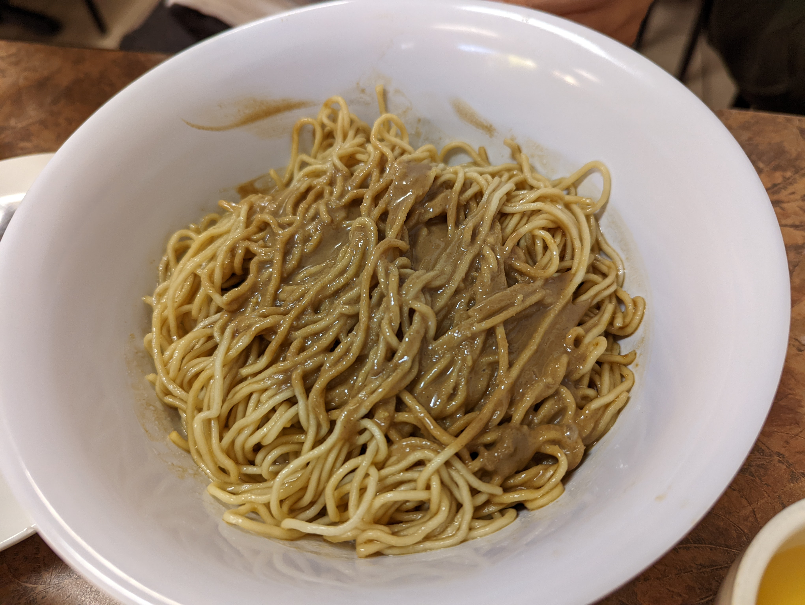
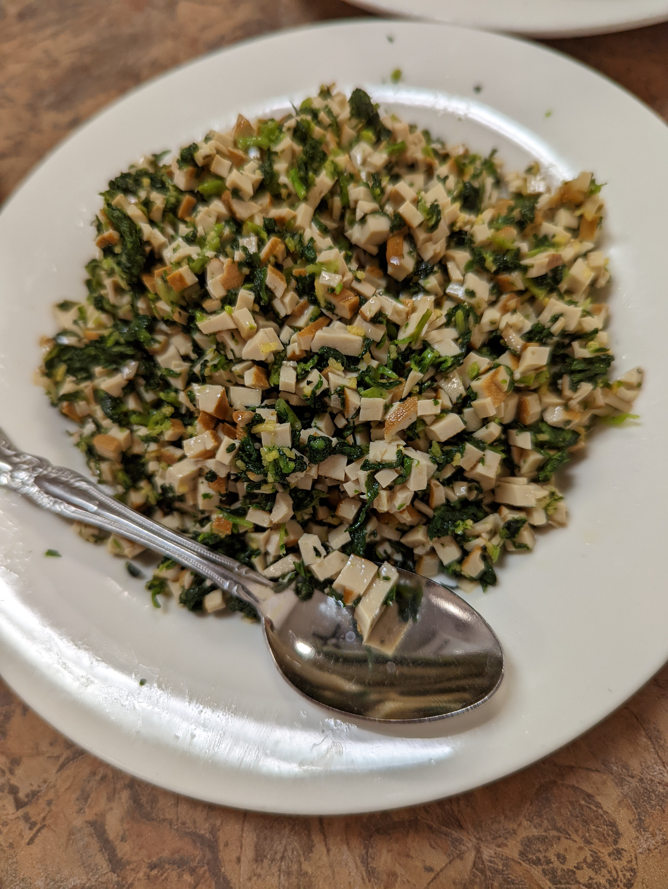

# Visit Datetime: 2022-06-26

## Explorer @tengyi

## Overall Score 体验评分: 7/10

## Current Exploration 当前探索

### Special Eel Noodle Soup 膳糊面

- 鳝鱼非常新鲜

- 咸鲜为主

### Sesame Sauce Noodle 麻酱拌面

- 经典的麻酱拌面：永远不会出错

### Shanghai Style Bun 上海小笼包

- 比较正宗的小笼汤包

### Shanghai Style Chow Mein 上海粗炒面

- 味香浓郁

- 粗面条嚼起来很有口感

## Soso 一般般

### Shanghai Style Pot Stickers 上海生煎包

- 汤还是可以的

- 底太硬了，有点划喉咙

## Shit Holes 避坑指南

### Cooked Chicken in Rice Wine 醉鸡

- 酒味太重了，吃的不是醉鸡的鸡味，是一晚上喝到吐的醉酒鸡身上的醉味

- 酒味太苦了

### Chinese Green with Dry Tofu 万年青凉拌豆腐干

- 吃进去完全是盐+味精
