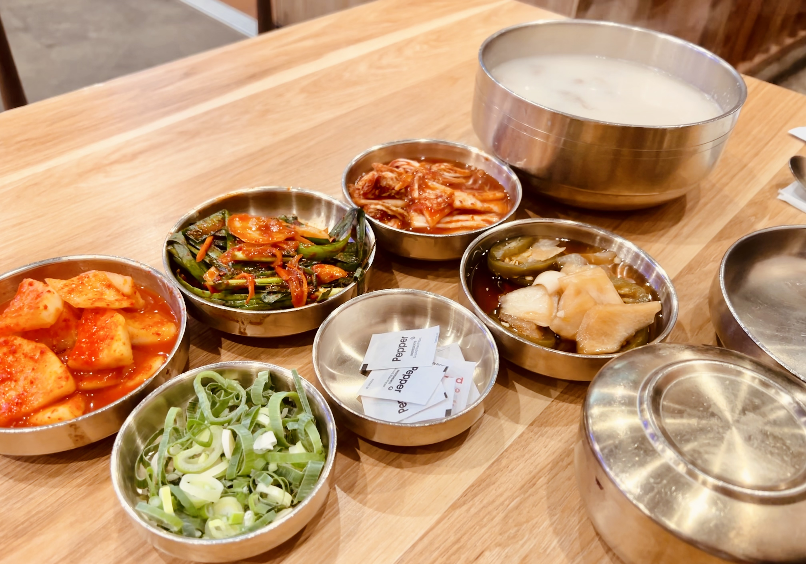

# Visit Datetime: 2022-07-17

## Explorer @kaijCH

## Overall Score 体验评分: 9/10

- 招牌炖牛肉加炙烤芝士强烈推荐，菜品份量十分足

- 餐厅不接受预定，到店之后也不留手机号短信通知，建议等位期间不要逛太远

## Current Exploration 当前探索

### Kalbi Jjim with Cheese 锅炖牛肉加芝士

- 强烈推荐不可错过！不论是牛肉在韩式肉酱与芝士交融衬托下的浓郁香味，还是碎芝士在菜品上桌后现场又火枪炙烤融化，都十分过瘾

- Regular Meat 完全能满足双人食量

### Kalbitang 牛肋肉汤

- 味道较为浓郁，但汤底肉料出品不是特别稳定，相比之前探索似乎份量比较少
