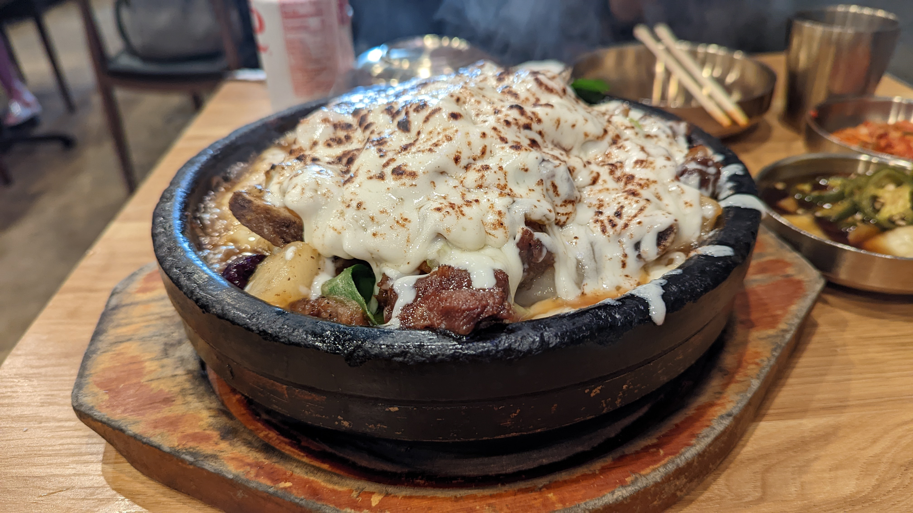

# Visit Datetime: 2022-10-16

## Explorer @tengyi

## Overall Score 体验评分: 9/10

- 招牌炖牛肉加炙烤芝士强烈推荐，菜品份量十分足。

- 餐厅不接受预定，排队时间特别长。

## General Recommendation 推荐

### Kalbi Jjim 韩式芝士牛肉锅

- 里面的年糕、土豆、胡萝卜都烧的非常入味非常好吃。我一般不怎么喜欢吃年糕，但是这个是少数能让我感兴趣的年糕。
- 牛肉非常新鲜，入口即化，没有什么筋——非常多汁。
- 唯一的缺点是芝士略甜，所以吃到后面等到芝士全部融化之后会让锅底的其他材料在汤汁的影响下（比如胡萝卜、土豆）显得过甜。

## Soso 一般般

暂无

## Shit Holes 避坑指南

暂无