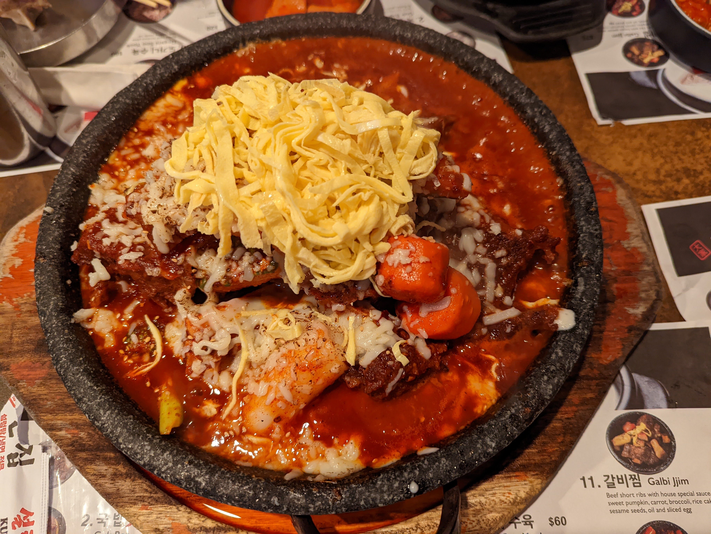
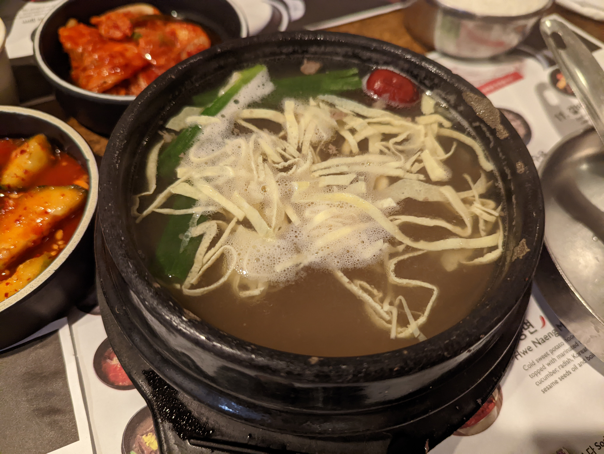
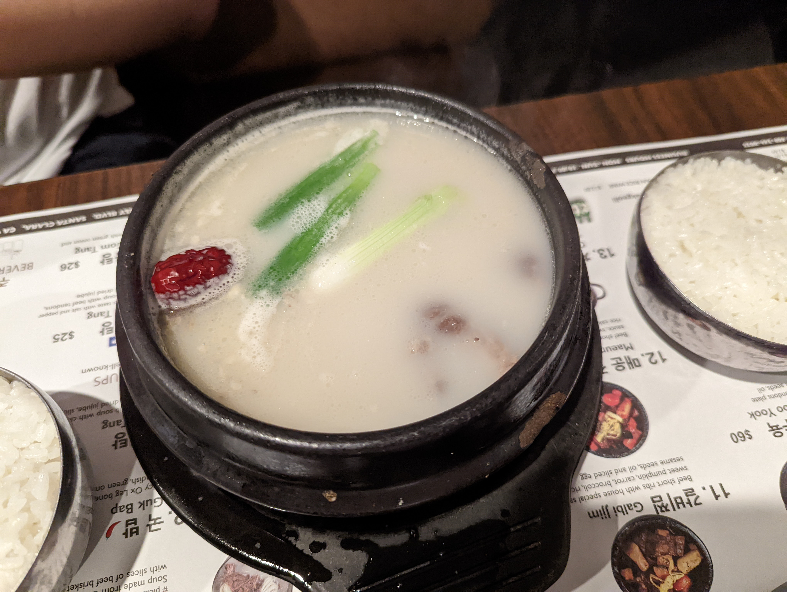
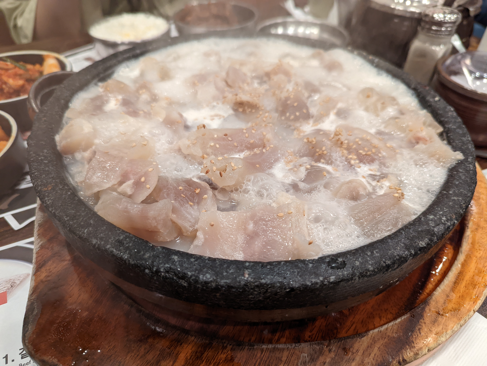

# Kunjip

## Location 地址

- [1066 Kiely Blvd, Santa Clara, CA 95051](https://goo.gl/maps/Adu9QzoXdQzaNq6R9)

- <https://kunjipsc.com/users/login>

## Cuisine 菜系

- Korean 韩国菜

## General Recommendation 推荐

### Cheese Maeun Galbi Jjim 芝士红烩蒸牛排骨

- 强力推荐的招牌菜，芝士和辣椒实在是太香了
- 香香香！
- 鸡蛋丝不怎么入味是唯一的缺点
- 牛肉非常软烂，入口满满的是辣椒、芝士和牛肉本身的香味，他们的混合不仅没有压住牛肉的味道，反而聚在一起爆发出更大的香味
- 注意是四人份的量

### Galbi_Tang 蛋丝红枣香葱牛排骨粉丝汤

- 清汤
- 牛骨飘香

### Kko Ri Gom Tang 牛尾香葱红枣汤

- 浓汤
- 加点白胡椒味道更好
- 不知道为什么，但是牛骨汤目前吃过的好像都不错，牛骨的味道很重

### Dogani Sooyook 水煮牛筋板

- 是真的一点味道没有，准备好盐往里倒一些吧。
- 香味还是很浓郁的

### Maeun Galbi Jjim 韩式辣味燉牛肋排

.jpg)

- 虽然没有芝士红烩燉牛肋排香，但是更带劲，辣味较大，容易喷射，小心！味道还是一样的好。

## Soso 一般般
暂无

## Shit Holes 避坑指南
暂无