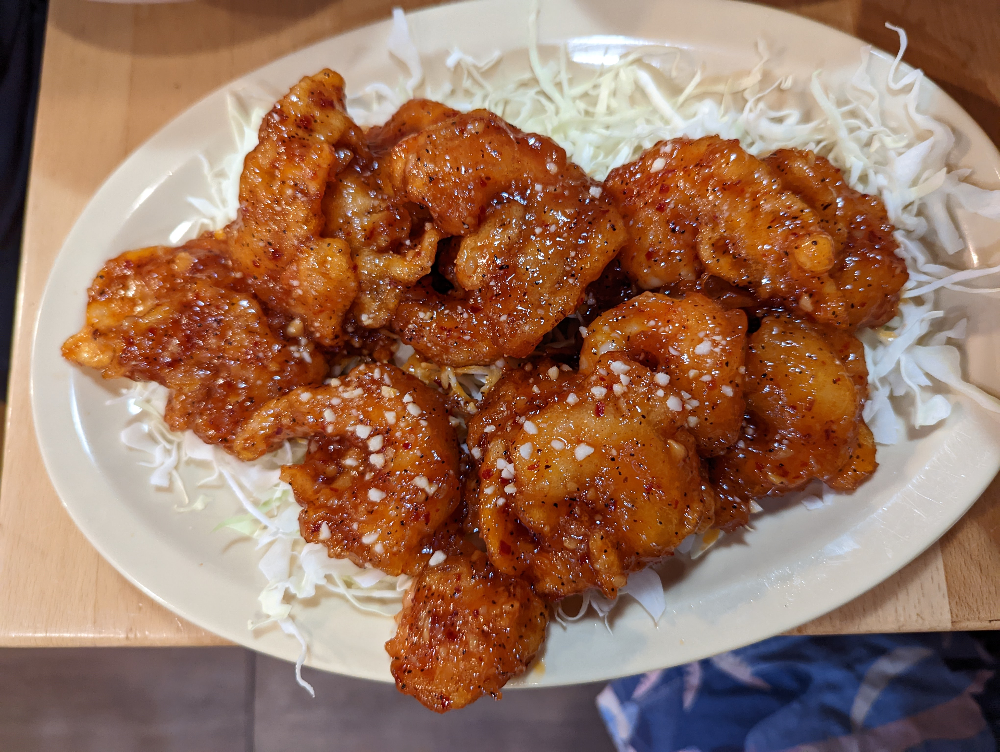
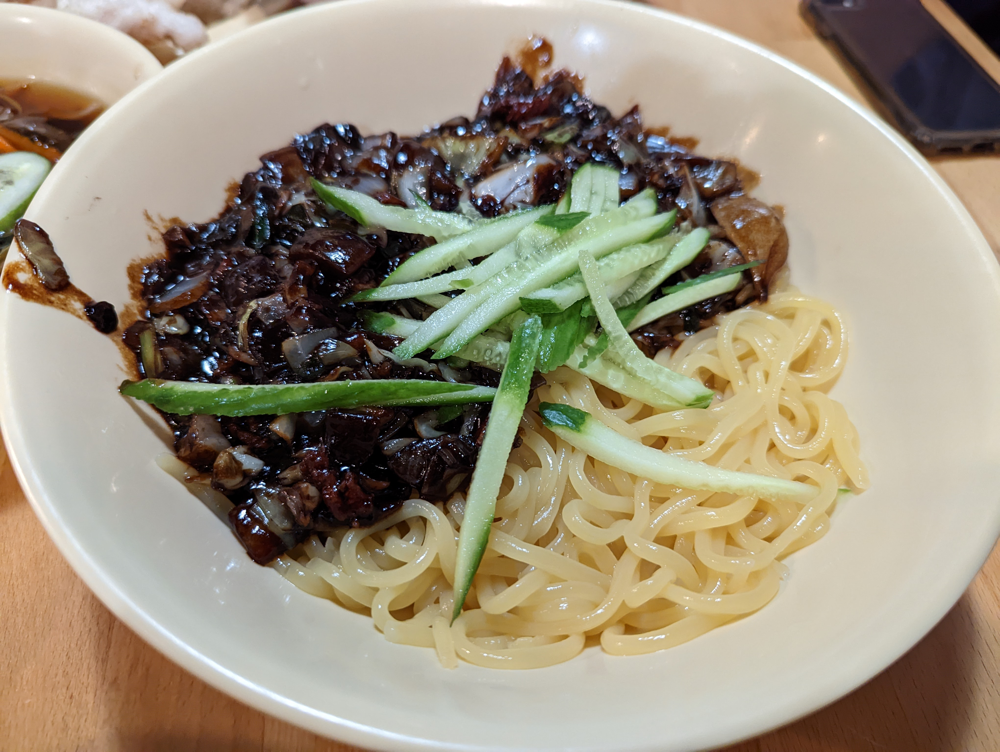
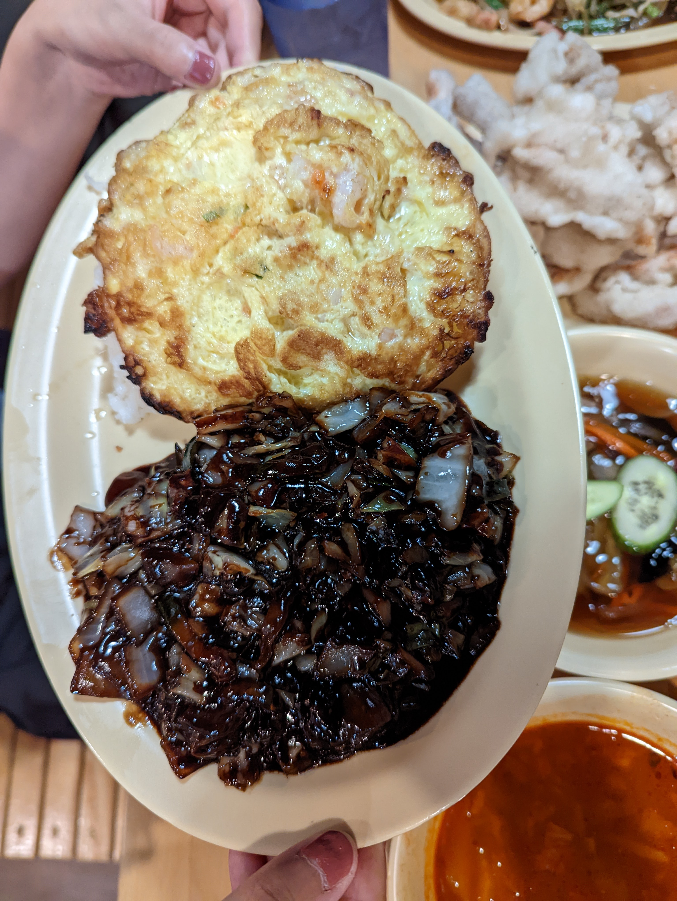
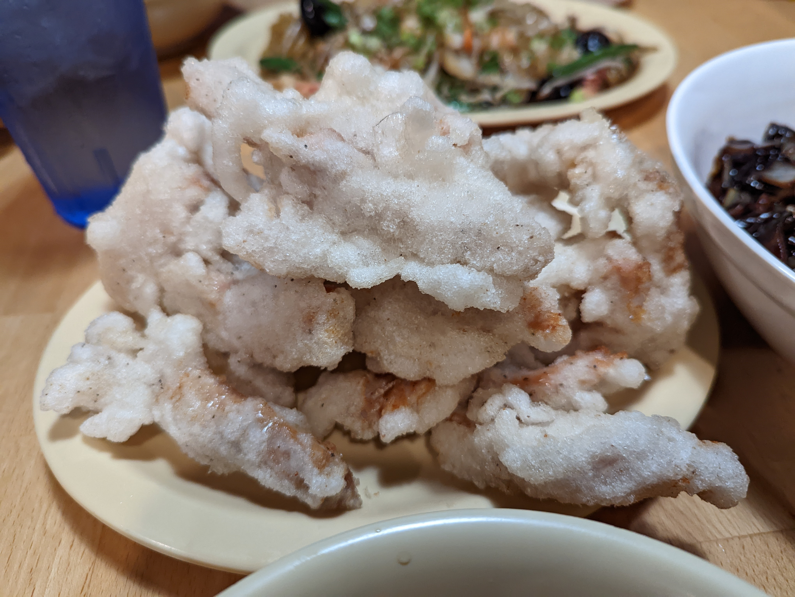

# Visit Datetime: 2022-06-06

## Explorer @tengyi

## Overall Score 体验评分: 6/10

- 喂我吃屎的餐厅还能上6及格分，纯粹是因为炒面好吃和炸酱面味道不错，勉强让我觉得还是可以上一上推荐。总体而言不推荐除了面之外任何菜式。

## General Recommendation 推荐

### Bokkeummyeon 炒面

- 香味十足，除了香没有第二个想法。
- 面非常筋道，很有嚼头。

### Chili Saeu 辣酱虾

- 味道还是很香的
- 酱汁是经典的韩国酱汁（酸甜辣+大蒜），就是还是那个大蒜味太浓重的问题

### Jajangmyeon 炸酱面

- 炸酱是属于咸甜口味的
- 面的口感还是很独特的：有劲道，又很顺滑，虽然是个实心面，嚼起来就感觉有点是在吃空心面的感觉。

## Soso 一般

### Jajang Bap 炸酱饭

- 就是炸酱+白米饭，没什么特别的
- 唯一特别的是炸酱饭的炸酱和炸酱面的炸酱比更咸，而甜味更少

## Shithole 避坑指南

### Tangsuyuk 糖醋里脊（真·屎，千万别碰！！100% serious）

- 虽然说是糖醋里脊，实际上是锅包的做法
- 这并不是重点，重点是猪肉无比地腥臭，之前我有个同事说他自从某次不小心吃了某餐馆美国猪肉后再也不敢吃猪肉，有心理阴影了，我之前不信，在吃过这道菜之后立刻信了。这种腥味不是人类可以忍受得了的。还好我过两天就自己买了猪肩肉做了一下，搞点肥肉炒了吃，发现不是猪肉的问题，是餐馆处理的问题。