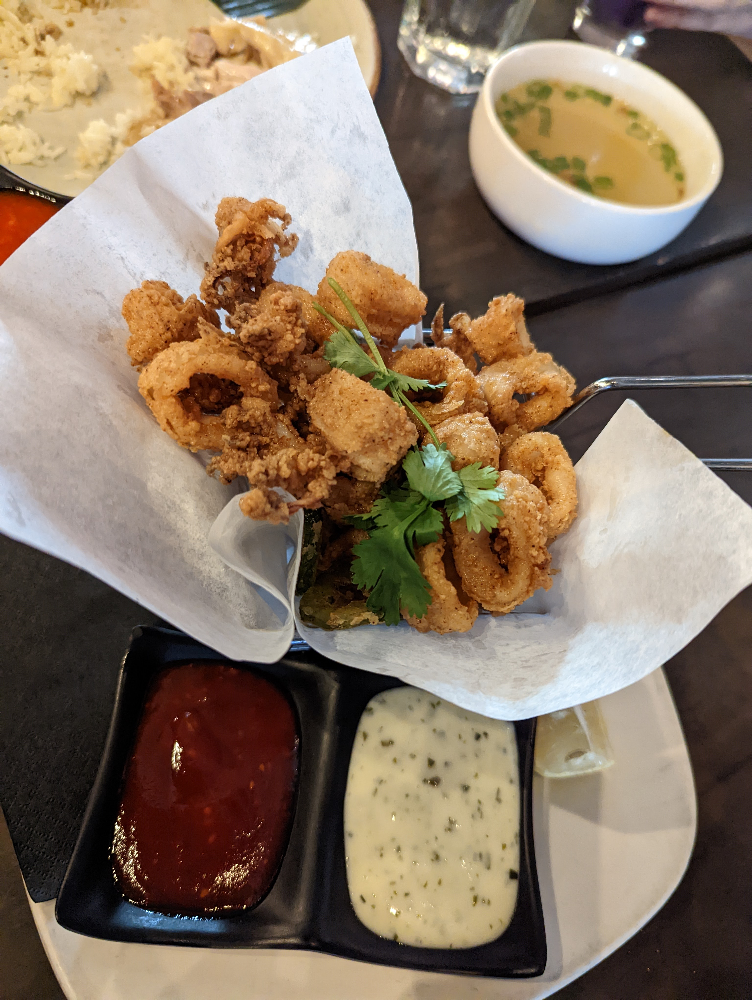
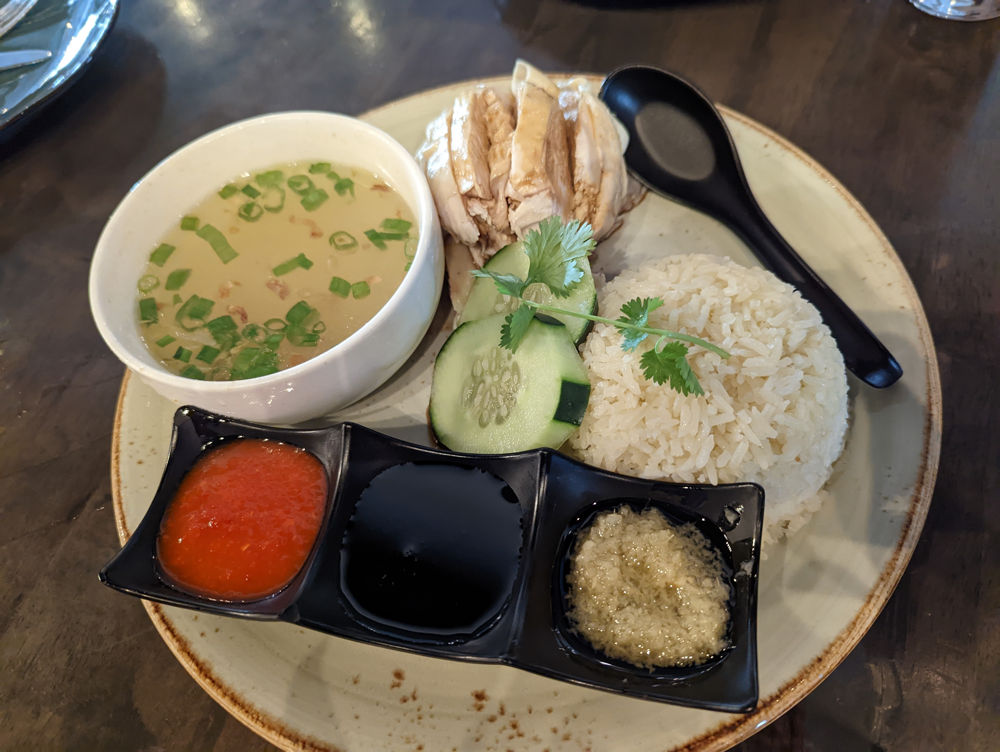
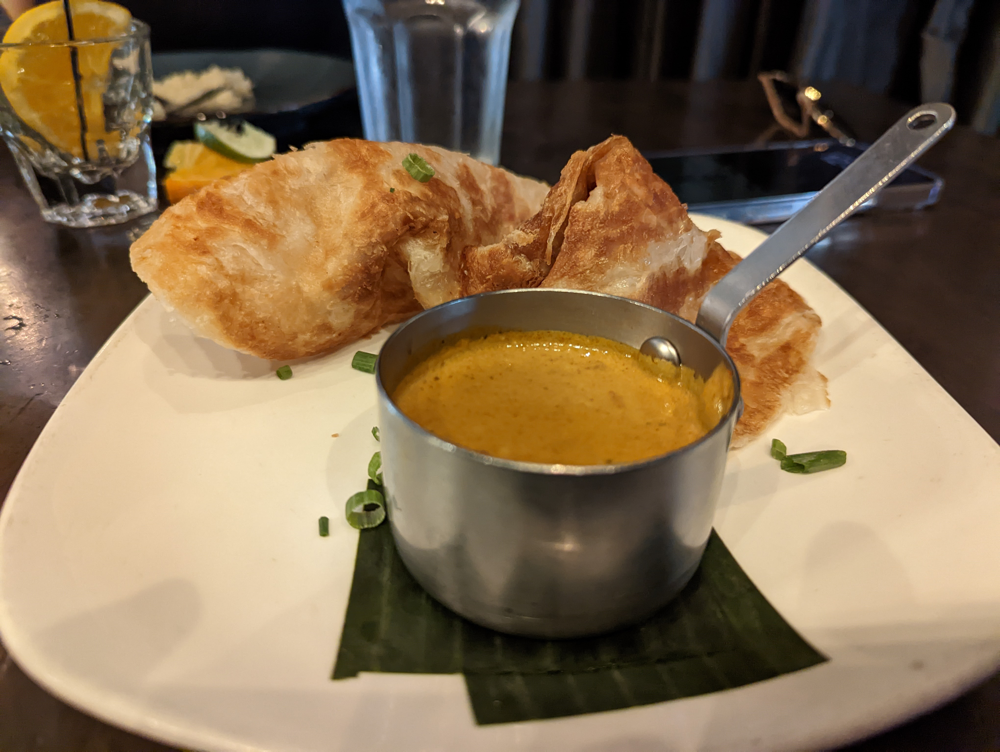
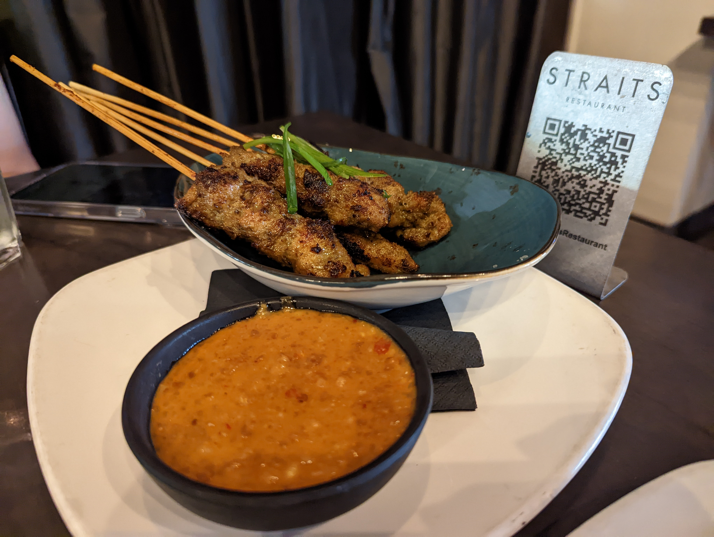
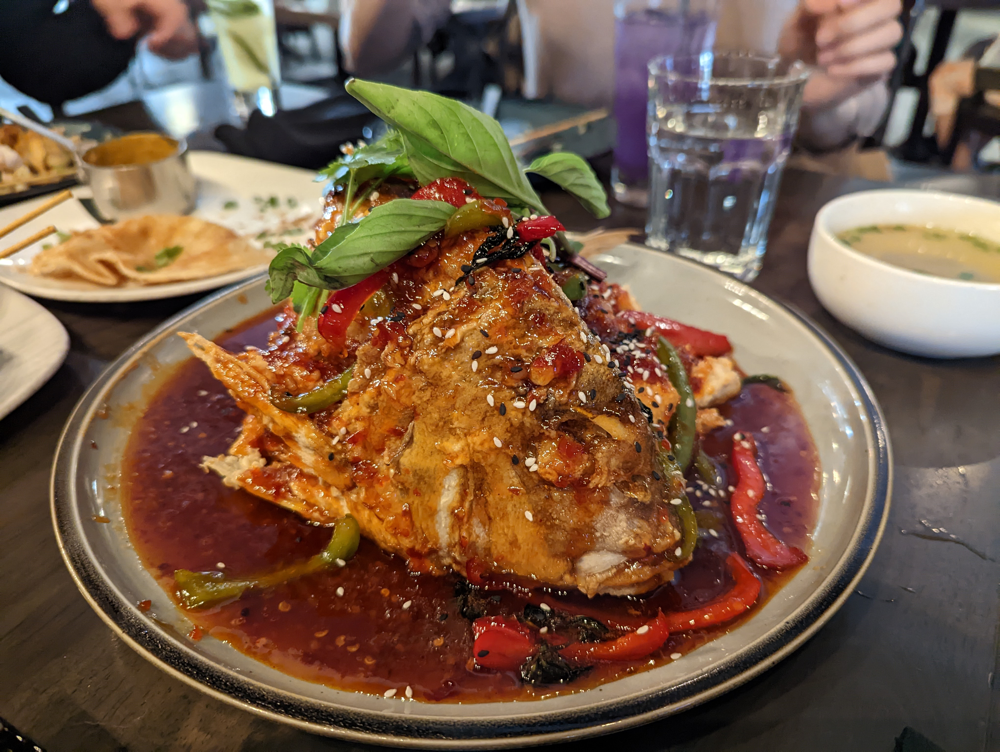

# Visit Datetime: 2022-09-30

## Explorer @tengyi

## Overall Score 体验评分: 7.5/10

虽然有惊艳的地方，但是总体来说调汁不是太甜就是太辣，融合的不是很好。

## General Recommendation 推荐

### Crispy Calamari 酥炸鱿鱼

- 和其他很多餐厅不太一样的点在于，他们家的酥炸鱿鱼不会过油以至于感觉到腻。酥炸鱿鱼本身很难难吃，但是在控制人吃完酥炸鱿鱼后不会屁股拉油这一点，这家餐厅做的非常好。

### Hainan Chicken 海南鸡饭

- 虽然说鲜味有所不足，但是由于鸡肉的滑嫩Q弹和那紧致的肉感让我想起了泡在牛奶里的少女肌肤，于是还是将其放到了推荐菜单

### Roti Prata 印度煎饼

- 我只能说实在是太好吃了，非常完美的口感和香味。印度菜在做饼这方面从来没有让人失望。
- 咖喱有点辣，但是被椰子中和了，因此哪怕嘴里已经火烧，但过一会儿就不烧了，让你还想再倒他一点咖喱。

### Singapore Satay Sticks 新加坡沙爹酱串串烧

- 这个沙爹酱味道实在是有点太甜，但是耐不住鸡肉的口感实在是太好了，他们是怎么把鸡肉做到有种干式熟成牛肉的松软口感的？

### Wok Fired Mussels 炒贻贝

- 这种海鲜向来都是我的最爱。
- 贻贝炒的还是很入味的。

## Soso 一般般

### Whole Tai Snapper 整鲷鱼

- 酱汁味道实在是太过浓郁了，以至于一时半会不知道人是在是调料还是在吃鱼。鱼的鲜味全部被辣椒蒜蓉汁覆盖了，虽然这个汁味道还行。
- 很辣，很辣，是喷射战士的前提。

## Shit Holes 避坑指南

### Samosa 萨摩萨

- 一种印度的传统小吃，但是这个味道确实是很怪，我不怎么能接受，甚至连拍照都忘了，恐怖的记忆甚至没能留下来。