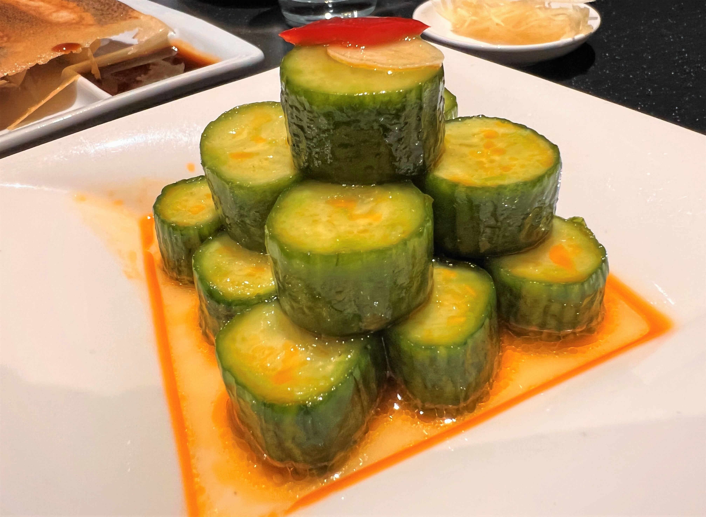
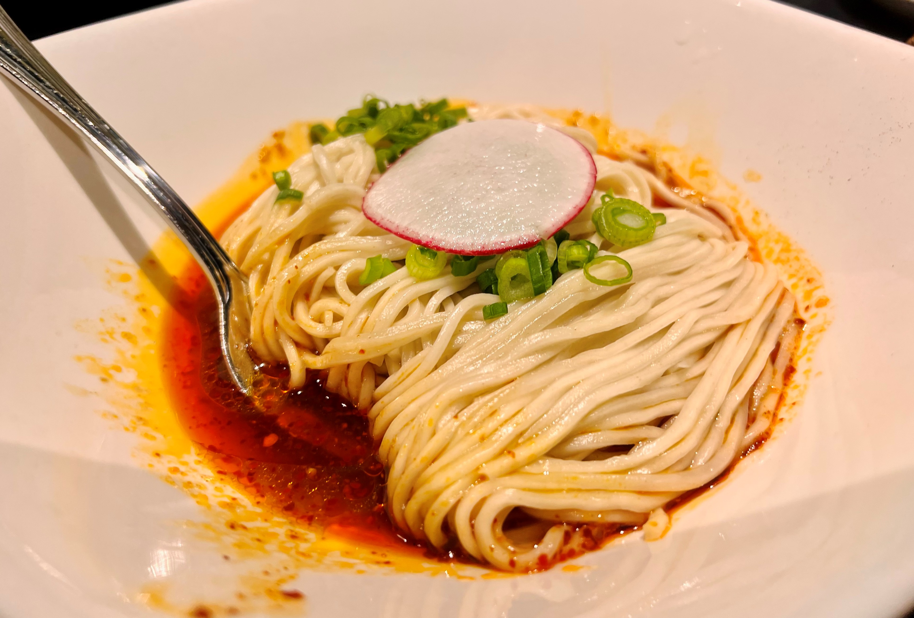

# Visit Datetime: 2022-11-10

## Explorer @kaijCH

## Overall Score 体验评分: 7/10

- 不论是包点还是其他点心都偏主打精致，口味在San Jose附近相对不错;

- 需要提前订位;

## Current Exploration 当前探索

### Cucumber Salad  凉拌黄瓜

- 中规中矩的前菜，与热茶一起挑醒味觉

### Sweet & Sour Pork Baby Ribs  糖醋小排

- 酸甜比例偏甜口，小排筋肉韧性相对合适轻轻咬下即能剥离

- 摆盘精致，量比较少

### Shrimp & Kurobuta Pork Wontons with Spicy Sauce  虾肉猪肉红油抄手

- 虾肉与猪肉的结合口感不够明显，抄手皮薄为口感拉回一程

- 辣酱其实带甜的味道非常讨喜

### Shrimp & Kurobuta Pork Pot Stickers  鲜虾猪肉锅贴

- 锅贴的脆底薄度还原到位，比普通饭店的锅贴表现好得多

### Cod Dumpling  鳕鱼蒸饺

- 鳕鱼馅的味道就十分有鲜味，汤汁也十分鲜

### Noodle with Spicy Sauce  红油拌面

- 拌面红油的味道偏辣，细面比较还原单个人不是特别好评，分量偏小
