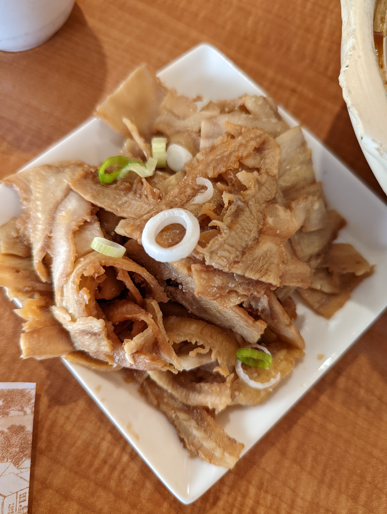
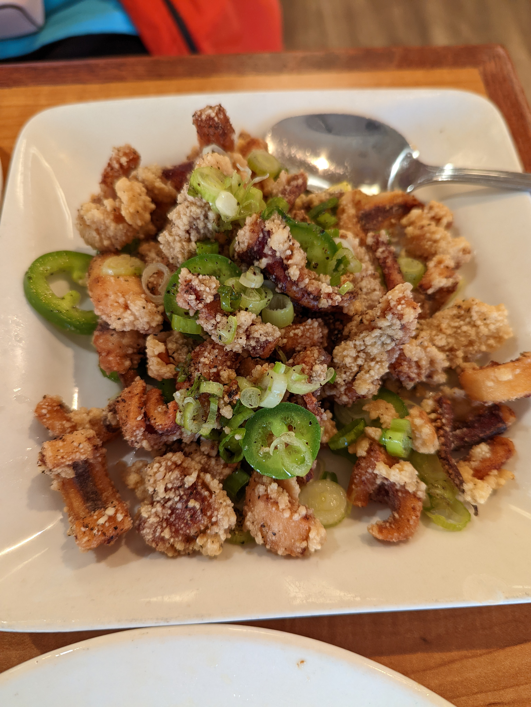
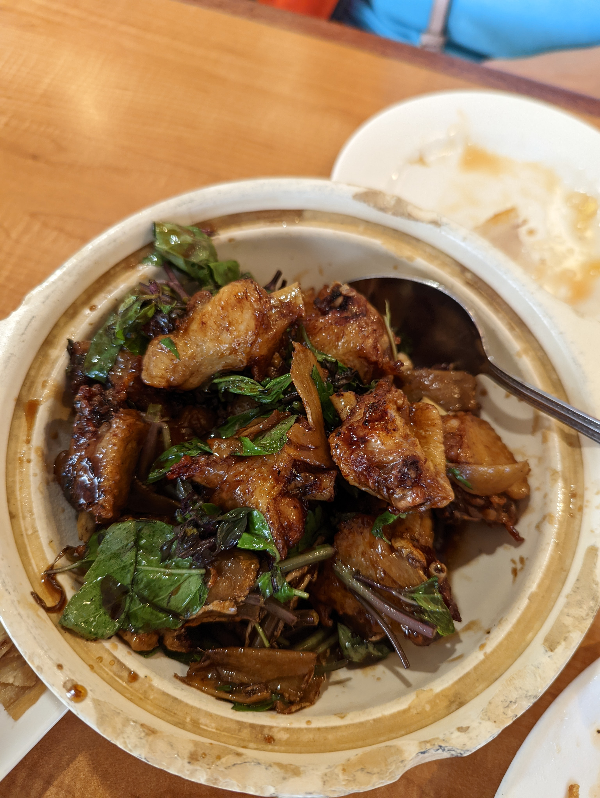
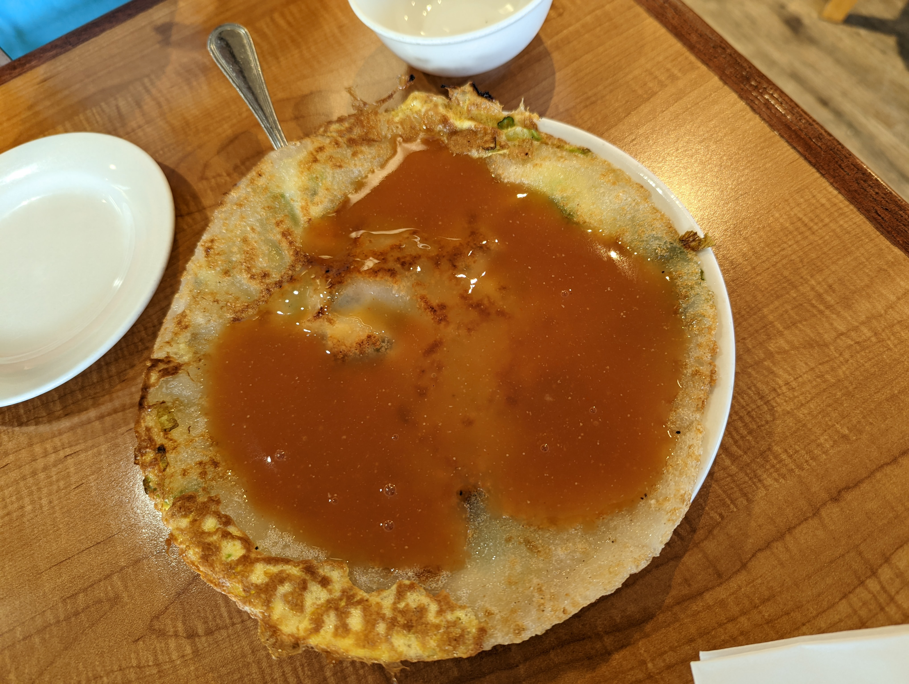

# Visit Datetime: 2022-07-04

## Explorer @tengyi

## Overall Score 体验评分: 8/10

## Current Exploration 当前探索

### Beef Tripe 卤牛肚

- 牛肚切的很薄
- 很入味，但是不会太重口味

### Fried Squid with Pepper and Salt 香酥鱿鱼

- 香酥鱿鱼这道菜要是做不好就可以进避坑指南了

### Three Cup Chicken 三杯鸡

- 三杯鸡这道名菜做的还算可以，需要注意的点是可能会做的比较糊，可能人太多为了上菜更快火开的有点大，导致和砂锅贴着的那一边稍微有一点焦，并且有点硬

## Soso 一般般
### Oyster Pancake 蚵仔煎

- 蚵仔的腥味没有完全去掉，但总体来说调味可以，所以也不算难吃

## Shit Holes 避坑指南

- 暂无
